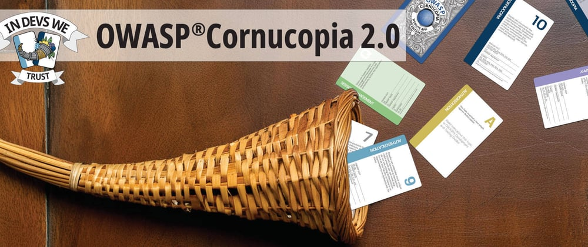
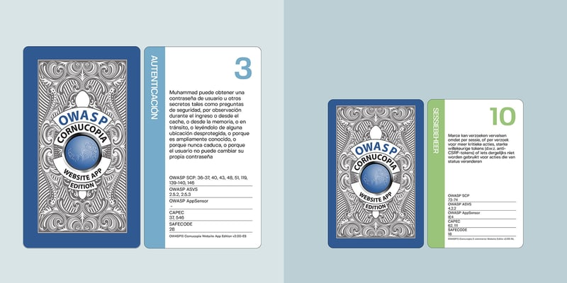
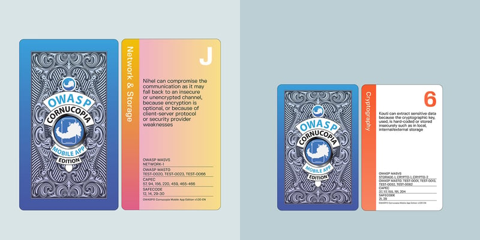
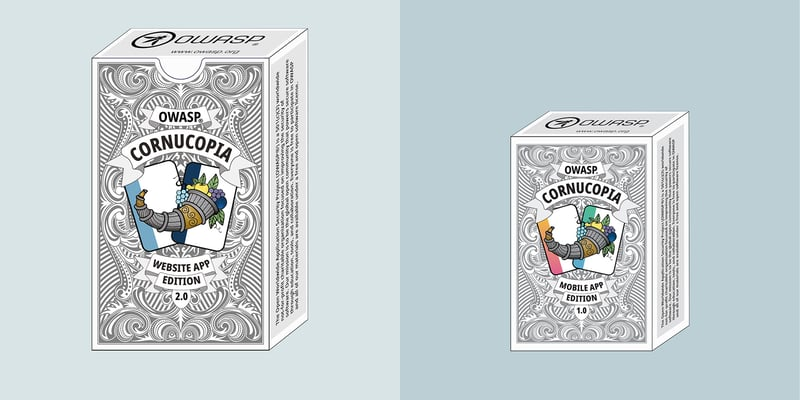
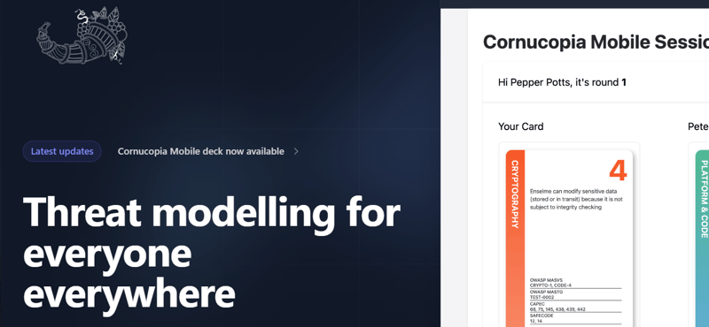

# OWASP® Cornucopia 2.0

_I started out as a web designer 16 years ago and my first website got brutally hacked, not once, but three times. I learned the hard way about the importance of threat modeling and having backups._
----------------------------------------------------------------------------------------------------------------------------------------------------------------------------------------------
[OWASP® Cornucopia 2.0](https://github.com/OWASP/cornucopia/releases/tag/v2.0.0)

Today, as one of the co-leaders for OWASP® Cornucopia together with Colin Watson and and Grant Ongers, I am very proud to share that we finally, with lots of help from contributors, supporters and backers and OWASPs hardworking employees are releasing OWASP® Cornucopia 2.0.

Why is this important and why should you care about this? First of all, as Adam Shostack would put it..

> “You never are going to have a better time than when people are having fun and talking to you.”

OWASP® Cornucopia is a threat modeling tool in the form of a card game to assist software development teams identify security requirements in Agile, conventional and formal development processes. It strives to be language, platform and technology-agnostic.

It’s one of the few tools that connects threat modeling with OWASP ASVS, MASVS, MASTG, SAFECode, SCP and CAPEC and helps to identify security requirements, come up with a security design and a threat model without any prior knowledge of any of this.

_How? OWASP® Cornucopia is open, democratic and agile, and that’s why it works._

At Admincontrol, we had been struggling for quite a while to get all our teams to do regularly threat-modeling sessions. It’s not that we weren’t able to do them it’s more that we didn’t see **active participation** during our threat modeling sessions. Either I would be the only one talking  or I would be the only one  coming  up  with  threats  and mitigations  during the threat modeling sessions.  
The initiative  always had to come from me. If I didn’t take the initiative for the sessions, they wouldn’t happen. But we thought that it’s not like everybody has the same experience and knowledge about threat modeling.  
Perhaps the teams lack training and knowledge about threat modeling? Perhaps it’s normal that not everybody can’t participate equally?  
So we tried to increase  and spread  the  knowledge  about threat modeling, but no matter what we would do, it wouldn’t change the nature of the sessions.  
We did **presentations** on threat modeling.  
We **trained** security champions  in doing threat modeling.  
We attended a large amount of **follow-up meetings** and **online sessions** together with the teams.  
We did threat-modeling on the **weekly security forums**.  
We even submitted  ISO 27001 ISMS  security incidents  on non-compliance  to the project managers.

_At a certain point I just had enough._

I remember, I was in a session together with one of the teams and It was like I was watching myself from the outside of my body while I was talking, saying the exact same thing I had said 100 times before  and I could see one of the poor people participating, falling asleep, while I was talking.

If you have  people in the meeting falling asleep, then that is not their fault, doesn’t matter how little  they may have slept  the night before  really, because if you have the people in your meeting engaged and in a dialog with you, then that won’t happen. So that was on me,  I had fallen in the trap of starting lecturing the people in the sessions. If anybody here have kids  you may have experienced  that if you start lecturing them, they  very  rarely  listen, but lecturing adults is not only stupid it’s also disrespectful. If you want engaging  and meaningful  conversations  you need active participation  from all parties.

So I wanted participation  in the meetings. I wanted the teams to take  the initiative  and I wanted the people participating to learn  something from them and take something with them back.

Now, after having used OWASP® Cornucopia for awhile, I can say that we have a lot more conversations during our threat modeling sessions then we used to. The teams themselves takes the initiative for threat modeling creates the threat models and come up with the threats that they need to mitigate. They take a lot more ownership, not only over the security requirement gathering and security design, but the functional testers have also started to do a lot more penetration testing. We are not that dependent any longer on having an external company doing penetration testing for us, and we are discovering more security issues earlier during development. thereby, reducing time to market and the number of defects found after the release.

From having these Cornucopia sessions we have learned that delegation of security requirement gathering, threat modeling and security planning is possible. The less we intervene, the better the overall quality of the sessions. As we are able to delegate the threat modeling to the teams we get an increased capacity for process improvement, facilitation, and we decrease the time-to-marked and number of production defects. From having these sessions we have also learned that everyone can actively participate regardless of their knowledge and experience, even the QA testers and project managers scores points and win rounds for threats in the game. And it can be fun too!

_But what about the [OWASP® Cornucopia 2.0 release](https://github.com/OWASP/cornucopia/releases/tag/v2.0.0)?_

Firstly, the formerly called “Cornucopia — Ecommerce Website Edition” is now called “Cornucopia — Website App Edition”. This edition was originally created in August 2012, released as v1.0 in February 2013 and has previously undergone a number of minor updates/releases in the following ten years. This has been substantially updated in today’s release of v2.0, in which the most noticeable change has been to update the OWASP ASVS mapping from ASVS v3.0 to v4.0. Further work on the data and code to generate the files for the cards themselves, the cases and folded leaflet and the legacy guide document has been undertaken, and this code also generates cards/cases/leaflets in two physical sizes. The smaller is often referred to as “bridge-sized cards” and the larger as “Tarot-sized cards”. All these v2.0 files are immediately available in six languages (EN, ES, FR, NL, NO-NB and PT-BR) due to efforts of past and current volunteers.

Secondly, as a result of other significant effort, there is now a completely new edition for threat modelling mobile apps. This “Cornucopia — Mobile App Edition” is released as v1.0 and is mapped to the OWASP Mobile Application Security Verification Standard (MASVS v2.0) and OWASP Mobile Application Security Testing Guide (MASTG) v1.7, and is available, initially, in one language (EN), and in two physical sizes. Like the original, this completely new edition of Cornucopia also has six suits of 13 cards plus two jokers, with the suit names drawn from MASVS: Platform & Code (PC), Authentication & Authorization (AA), Network & Storage (NS), Resilience (RS), Cryptography (CRM) and Cornucopia (COM).

The new Cornucopia Mobile App Edition 1.0

Both releases also have newly updated case designs.

Two new Cornucopia case designs

Finally, we are releasing a brand new website called “Copi”, available from [https://copi.owasp.org](https://copi.owasp.org) for online collaboration and gaming where you and your team can play both these games even if you are present in different locations.

You can download printable files from [https://github.com/OWASP/cornucopia/releases/tag/v2.0.0](https://github.com/OWASP/cornucopia/releases/tag/v2.0.0)

We thank everyone who has contributed to OWASP® Cornucopia over the years, without whom these latest releases would not have been possible.

For more information about OWASP® Cornucopia, please visit: [https://cornucopia.owasp.org/](https://cornucopia.owasp.org/)

Later this month OWASP® Cornucopia is taking part in the project showcase track at [OWASP Global AppSec Lisbon 2024](https://owaspglobalappseclisbon2024.sched.com/event/1dmvE/owasp-cornucopia).

---

[OWASP](https://owasp.org) is a non-profit foundation that envisions a world with no more insecure software. Our mission is to be the global open community that powers secure software through education, tools, and collaboration. We maintain hundreds of open source projects, run industry-leading educational and training conferences, and meet through over 250 chapters worldwide.
