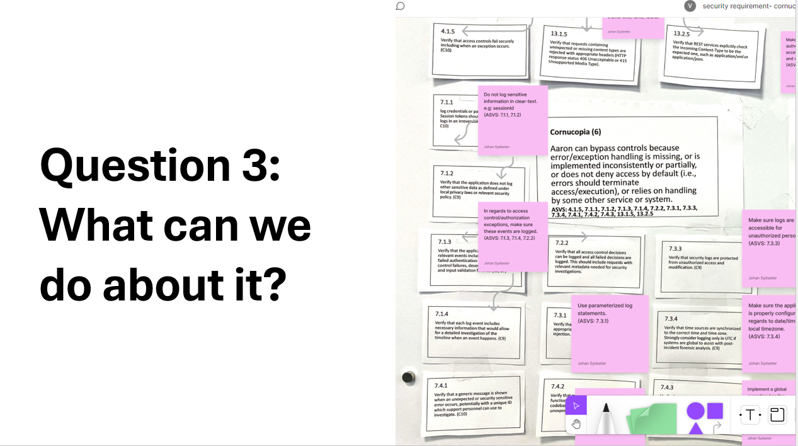

# How do you gamify threat modeling and application security design?

## OWASP Cornucopia - Mobile App Edition

Did you know that there is a game for threat modelling mobile apps? The ["OWASP Cornucopia - Mobile App Edition"](https://cornucopia.owasp.org/cards) is mapped to the OWASP Mobile Application Security Verification Standard ([MASVS v2.0](https://mas.owasp.org/MASVS/)) and OWASP Mobile Application Security Testing Guide ([MASTG v1.7](https://mas.owasp.org/MASTG/)), only available in English, for now. The deck has six suits of 13 cards plus two jokers, with the suit names taken from MASVS: Platform & Code (PC), Authentication & Authorization (AA), Network & Storage (NS), Resilience (RS), Cryptography (CRM) and Cornucopia (CM) which contains threats related to MASVS Privacy requirements, and where we also have added some nasty cards related to mobile malware.

So how do you gamify threat modeling and application security design? I would start with just playing the game. Get a group of people together at your company with an interest in security. It can be testers web developers, mobile developer, doesn’t matter. Buy pizza, beer, candy or coffee get together and just do it. Don’t think about it, have fun and just do it. Why?

## Agile Application Security

Because it’s the fastest way of creating value and showing results.
We want a culture of finding and fixing design issues, and we want people collaborating and having fun and we know that everyone is on a journey of discovery. We acknowledge that we do not have all the answers, but we believe we can find them together. 
And we want to do it now, we do not want to partake in wishful thinking. 
We know it won’t be perfect, but we will continuously refine the process and models as we learn more about what it is we are making.
We want to adapt application security to agile development processes, not the other way around.
And if you want to know more about this, you should check out the Threat Modeling Manifesto where these values come from.

## Adam Shostack’s 4 Question Frame for Threat Modeling

And to make is as simple and agile as possible so that everyone can partake and understand the process, we narrow it down to finding the answers to 4 simple questions:

1. What are we working on?
2. What can go wrong?
3. What can we do about it?
4. Did we do a good job?

(source: [Shostack's 4 Question Frame for Threat Modeling](https://github.com/adamshostack/4QuestionFrame))

## Enlist a Volunteer Army: Get Others to Help You and Help Them as Well.

It sounds so simple, but it really isn’t because the next part is a little bit more difficult. To make it stick, you need to enlist a volunteer army of security minded people willing to meet on a regular basis. Once every two weeks is enough, but even if it’s just every two weeks, it’s essentially time and resources that those people will invest in spending time with you doing application security work. 
And the way you sell it is by saying that it’s a way for you to help each other doing secure agile software development. And that’s it.
They don’t need to be security champions. It just needs to be people representing their development team that want to help with application security.
And the next thing you know, you have one person representing every team doing application security and threat modeling, doing the job on your behalf. 
Not so that you don’t need to, but because it’s the only way you can make them feel good about it when they get the recognition for what they have done and collect the price.

## Build a Guiding Coalition: Get Everyone on Board

Present what you're doing to your CISO, CTO and product owners, get everyone on board and build a guiding coalition to help you and support you.
If you have already had a group of security minded people that you have done threat modeling with, then this part is easy.
Because even though everyone is asking themselves what this crazy group of people are doing, they will respect it and support it as long as it's working.
So, all you need to do is write down all the whats, the whys and the hows, add them to a presentation, then present it to your CISO/CTO+product owners.
Make sure you make them understand that you will be there and give support, then ask for a pilot project where you can introduce threat modeling for mobile applications. 
It can be a new mobile app, a new mobile api or something much smaller. Doesn’t matter how big or small it is.

## Get Everyone to Commit

What matters is that you make everyone commit to what you will be doing.
Don’t just do an online session. Buy your plane ticket, book your hotel, and spend 2 days with the mobile development team. 
Not all development teams like to draw models, but ask the team to create a simple model. So remember to point out that the model doesn’t need to be perfect. It just needs to show the basic processes, storage, and data flows that they will be implementing.
It shouldn’t take more than 1 hour to complete it, but make sure they understand that it needs to be there before the threat modeling session.

Also buy some funny prices. If you go to the [OWASP Cornucopia website](/swags), you will find a lot of suggestions for prices, but it’s better if you use your imagination, come up with some ideas yourself, and make some fun out of it. 

![Cornucopia beer glass [medium]](cornucopia_beer_glass.png)

But before all of that, get the cards, either go to [copi.owasp.org](https://copi.owasp.org "[external]") to play the online version, or download the high-res design files from [cornucopia.owasp.org](/printing) and get them printed. You can also buy the physical decks at [one of the webshops](/webshop) where you can buy the decks as well. A small part of the profits from the sales goes to the OWASP® Foundation.

## Let the Cards Speak and the Team Decide.

You don’t need to be a specialist on mobile application security to lead a OWASP Cornucopia mobile threat modeling session. Letting the team take control over the session themselves is what works best. Once a card is played the player needs to explain how the threat may be applicable to their mobile application. If the rest of the team agrees that it is the case, then the player gets a point. Then later, when adding the specific threat to the threat model, the team can use the references on the card to figure out what they need to do in order to mitigate the threat. It allows the team to immediately create a security focused user story in Jira and connect that to the MASVS and MASTG requirements and tests which should give guidance both in regard to implementing a secure design and create automated tests that can be used in MAS testing.

## The Role of the Application Security Engineer

The application security engineer's role, during the game, is to support the team by recording the cards that score points on [a score sheet](https://owasp.org/www-project-cornucopia/assets/files/cornucopia-scoresheet-mobileapp.pdf) so that you can keep track of what cards are played, and what the team discuss during the game. Later, when the development team create security focused user stories, you can help them to remember what it was they were discussing during the game and which threats they identified as relevant and important for creating a secure design for their application. 

When application security engineers no longer are bottlenecks in the agile development processes, scaling application security efforts becomes much easier. Cornucopia is empowering and teaching the development teams how to do threat modeling, what to test and implement, what to plan, and how to execute security work. It is helping to deliver faster, make the teams more independent, and shifting security efforts left. Application security engineers are needed, but the focus is turned towards facilitation, cheerleading and training.

## Story board mapping – Create user stories

After you have finished the game, don’t stop there, have a second session with the team where you look at the cards that scored and create security focused user stories. If the scope of what you are building is large, do a storyboard mapping where you group the cards together that share the same MASVS and MASTG references then get the team to decide what it is they are going to implement and test. If you’re not located at the same location, you can do this by using a Digital solution for agile online collaboration like Figma, or if you’re co-located, just create a large cardboard and either print out the description for each cards with their requirements, or stick the cards themselves to it and let the team create user stories on post-it notes based on MASVS/MASTG and the notes that was taken during the game.

Then don’t forget to ask the product owner, during the session, to add the stories directly into your issue tracking software under the epic that the team is working on. This way, they will be mandated and empowered to implement the security controls they identified in order to finish the epic. 

## Threat modeling – Keep track of the risk

Also, give the team a threat modeling tool and ask them to add the Jira issues to the threats in the threat model so that the team can keep track of which security controls the team has implemented in order to mitigate the threats they identified.

## Don’t forget to celebrate your short-term wins!

And don’t forget to celebrate your short-term wins, present what the team is doing to everyone in the organization, buy pizza and beer, and make noise about how the development team is having success with what they are doing. Wins are the molecules of results, they must be collected, categorized and communicated – early and often – to track progress and energize your volunteer army to drive change.

