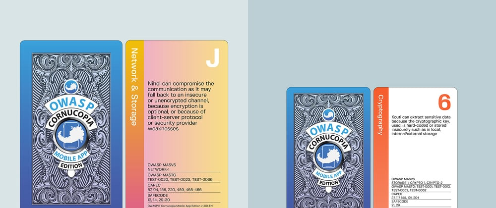
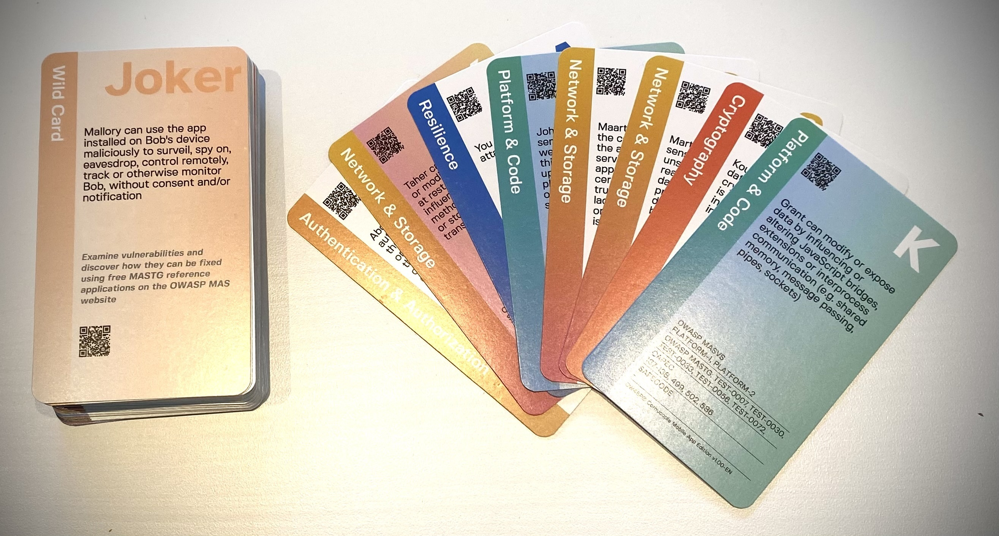
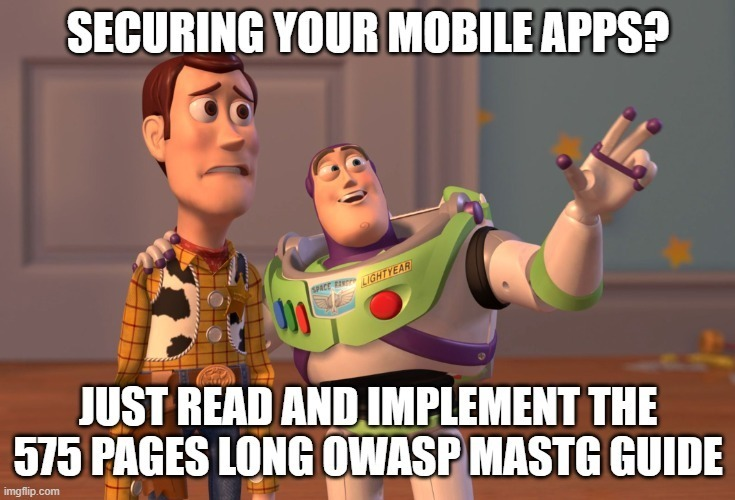
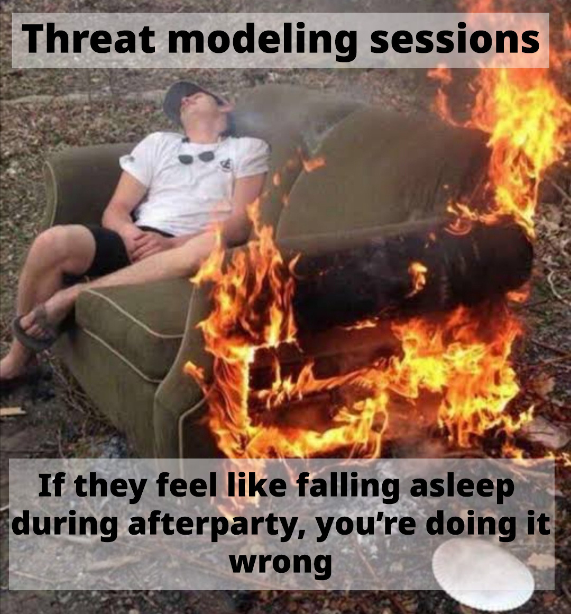
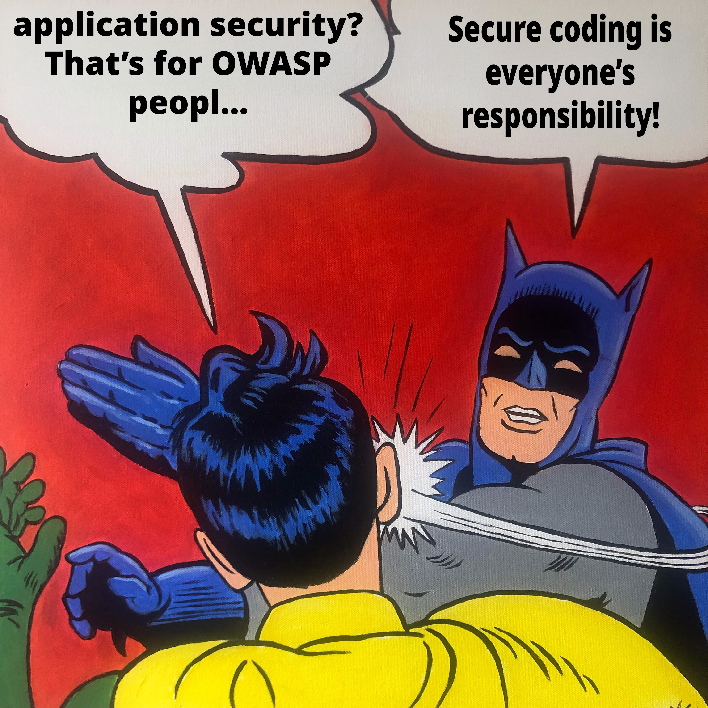

# How to pass the OWASP MASVS verification by design

_In Admincontrol, both our Android app and our IOS app just passed the MASVS 2.0 verification. And we did so by deciding on the security requirements and -controls using a game. Here is how..._
----------------------------------------------------------------------------------------------------------------------------------------------------------------------------------------------

In April 2023, OWASP released version [v2.0.0 of their “Mobile Application Security Verification Standard.”](https://mas.owasp.org/MASVS/) The new version removes the three verification levels called L1, L2, and R. Security control group verification requirements was reworked as “security testing profiles” and moved to the OWASP Mobile Application Security Testing Guide or “MASTG.” These profiles are now aligned with the NIST (National Institute of Standards and Technology) OSCAL (Open Security Controls Assessment Language) standard. The standard is to be used together with the OWASP Mobile Application Security Testing Guide ([MASTG v1.7](https://mas.owasp.org/MASTG/)) that comes with at least 82 tests that a mobile penetration tester should conduct in order to verify that the mobile application follows the MASVS standard.

_It can be overwhelming for any mobile development team to go through all the requirements and tests that MASVS and the 575 pages long MASTG guide brings with them, but what if I told you that there is a game for deciding on the initial security requirements, tests and implementation for passing the MASVS verification?_

## How to pass the MASVS verification by design 
In [Admincontrol](https://admincontrol.com/), where I work, we wanted to make a new Android mobile app for our board portal services. As we benchmark the security of our webservices against ASVS L2 and our mobile apps against MASVS L2+R, we needed an agile way of making sure that all the MASVS requirements and the complete MASTG guide (which is 575 pages long) got taken into account when creating the secure design for the new mobile application. Otherwise, we would risk delivering an insecure app to our security aware users and fail the MASVS verification.
Luckily we had discovered a game called OWASP Cornucopia that could be used for identifying application security requirement, create a secure design and do threat modeling. There was just one problem. The game wasn't meant for mobile application development. 

I knew that we couldn't just dump the 575 pages long mobile application security test guide in the mobile app developers laps. Doing so, would either prolong the development time extensively, or end up being ignored. Fortunately, the OWASP Cornucopia project was looking at creating a new mobile edition of OWASP Cornucopia. So I got in touch with the OWASP Cornucopia project where Xavier Godard had taken the initiative of making the new edition. Over the course of the next 3 months we finished the new ["OWASP Cornucopia - Mobile App Edition"](https://cornucopia.owasp.org/cards). We mapped it to the OWASP Mobile Application Security Verification Standard ([MASVS v2.0](https://mas.owasp.org/MASVS/)) and OWASP Mobile Application Security Testing Guide ([MASTG v1.7](https://mas.owasp.org/MASTG/)) and created six suits of 13 cards each plus two jokers, with the suit names taken from MASVS: Platform & Code (PC), Authentication & Authorization (AA), Network & Storage (NS), Resilience (RS), Cryptography (CRM) and Cornucopia (CM) which contained threats related to MASVS Privacy requirements, and where we also added some nasty cards related to mobile malware. Then we used the game to identify the mobile application security requirements, do threat modeling, and complete a secure design for our new mobile application.
9 months after we started the mobile application development of the new mobile app, an external company completed penetration testing and MASVS 2.0 verification with a MAS L2+R profile and verified that the mobile app had passed all of the requirements with just one low severity finding.

_But why did we go to such lengths of investing tremendous efforts in creating a threat modeling game?_

## Threat modeling as a tool for shifting security efforts left

In Admincontrol, we had long been struggling to get the developers to participate actively in threat modeling sessions. Most of them would usually stay quiet, too embarrassed to participate in the conversation. They would rely heavily on the input from security engineers and security champions to formulate security requirements and -controls needed in order to implement security design and -architecture. 
They rarely took initiative during threat modeling sessions or helped to do threat modeling and requirement gathering. We also found that testers would only focus on testing the functional requirements for the software implementation under test and never do penetration testing themselves. We therefore came to the realization that we needed to give the development teams a set of already defined applicable threats and risks they could choose from and talk about and that could work as triggers to help them come up with security requirements and -controls themselves.

Doing so, in the form of a game, helped increase the participants' ownership over the process, although it was the cards that were speaking, they were the ones that were choosing, explaining, scoring points and getting the attention.
This tremendously helped increase motivation and ownership over the process and has been key in scaling application security for companies doing software development. It’s no longer hard to elect security champions from the teams, and threat modeling, planning and testing is much easier to execute than before.
As application security engineers no longer are bottlenecks in the agile development processes, scaling application security efforts has become much easier. Cornucopia is empowering and teaching the development teams how to do threat modeling, what to test and implement, what to plan and how to execute security work. It is helping us to deliver faster, make the teams more independent, and shifting security efforts left. Application security engineers are needed, but the focus is turned towards facilitation, cheerleading and training.

## The new OWASP Cornucopia website
This has further been simplified with the new [OWASP Cornucopia website](https://cornucopia.owasp.org) and -QR codes that we now are launching. The website will allow the development teams to much more easily find the security requirements and -controls strengthening shift-left and agile application security methodologies. Looking ahead, we will continue to empower the development teams by making it easier to use OWASP Cornucopia together with other OWASP resources. We believe integrating the online solution with other tools will increase productivity and adaptation. Not having the same information in multiple systems will make it easier to keep the information correct and up to date. We will work on increasing the interoperability between OWASP Cornucopia and other OWASP projects. By doing so, we will also help you scale your application security efforts and empower your agile cross functional development teams, and we are looking for others that would like to take part on our journey.

## We are looking for your support

OWASP Cornucopia is about community. We would have gotten nowhere without the help of all the people that has supported OWASP Cornucopia over the course of the years this is why, when making the first version of OWASP Cornucopia, Colin Watson though it would be a great idea if the threat actors on the cards had the names from members and employees from the OWASP Foundation. The Mobile App edition follows that tradition. That is why we picked threat actor names, for the threat scenarios on the cards, from OWASP Global board, OWASP Staff, project members and OWASP chapter leaders from around the world, but we still need your support. We are looking for volunteers that would like to help us improve the new website and that would like to help translate the materials into various languages to ensure that developers who don't have English as their mother tongue, understand the security requirements and controls presented to them. We are also looking for ideas and help in maintaining and improving the new website to ensure it becomes a valuable tool for everyone looking at solving application security challenges.

---

[OWASP](https://owasp.org) is a non-profit foundation that envisions a world with no more insecure software. Our mission is to be the global open community that powers secure software through education, tools, and collaboration. We maintain hundreds of open source projects, run industry-leading educational and training conferences, and meet through over 250 chapters worldwide.