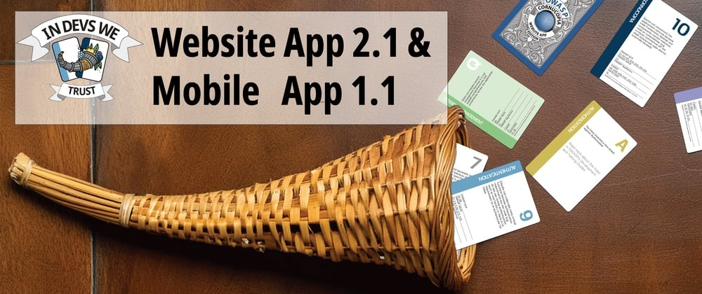
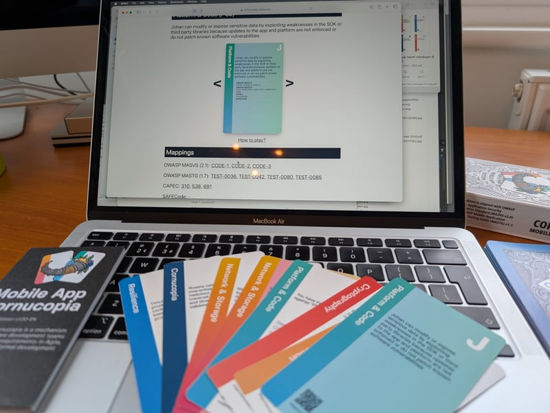
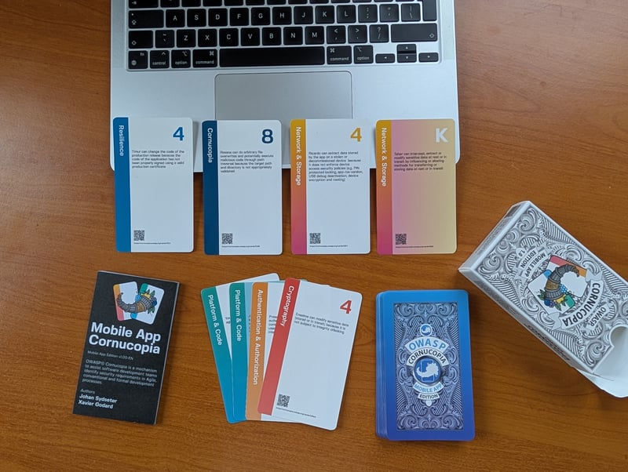
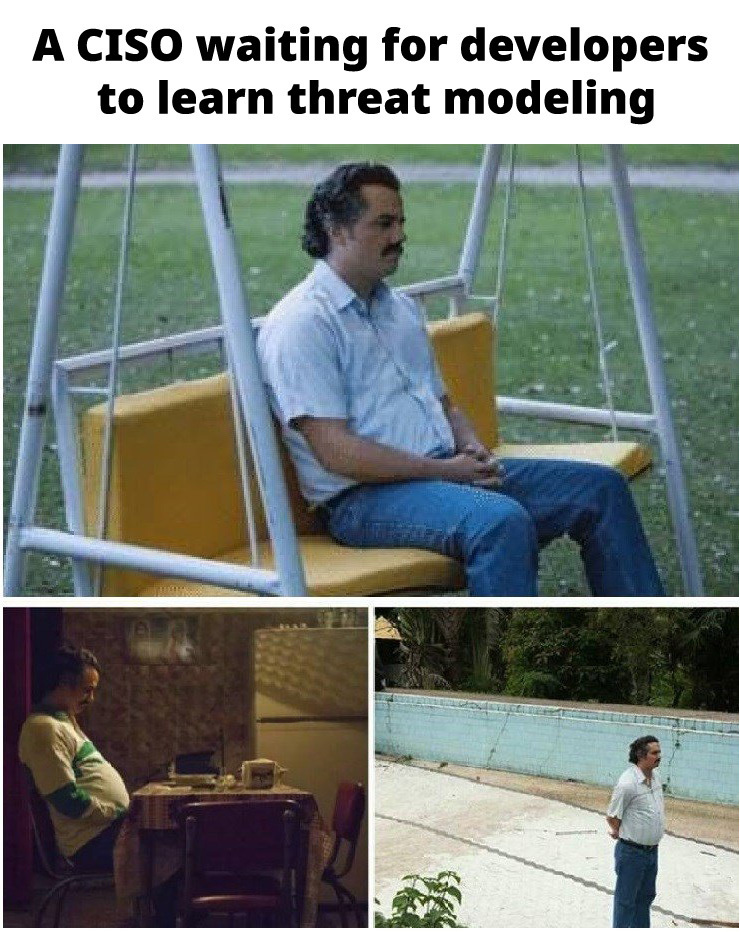
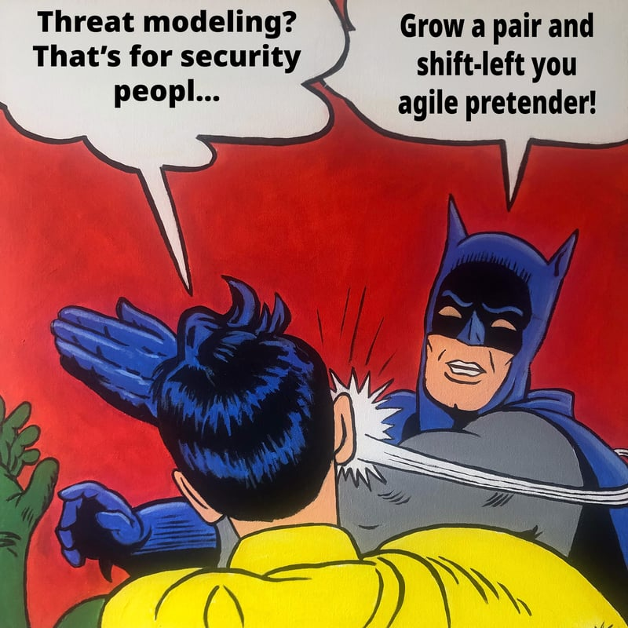

# OWASP® Cornucopia Website App 2.1 & Mobile App 1.1!

_OWASP® Cornucopia is launching brand-new versions of the OWASP Cornucopia decks with QR codes and a new website that will make threat modeling, security requirement gathering and security design much easier._
----------------------------------------------------------------------------------------------------------------------------------------------------------------------------------------------

Each of the QR codes will take you to a brand new OWASP Cornucopia website where you can further explore each card and the security requirements and -controls connected to them  (see: https://cornucopia.owap.org/ ).
This will help scale secure design and requirement gathering activities for your development teams and empower them to do application security in a more agile way. 

## A new OWASP Cornucopia website

In recent years, other OWASP projects have created their own custom websites to have greater control over content and layout. With the recent successful codification of all the Cornucopia materials for both the Website App Edition and Mobile App Edition, our project has now also created a custom website using an owasp.org

subdomain:

https://cornucopia.owasp.org

We would like to thank dotNET lab for donating their website code for this development. Volunteer Jef Meijvis were instrumental in making the website with the help from the rest of the project team. All the source code is located in our repository, providing a way to maintain consistency by using some of the same data sources. The website's repo is at:

https://github.com/OWASP/cornucopia/tree/master/cornucopia.owasp.org

This has allowed us to add a news section, and reinstate an extended version of the Wiki Deck, originally created by former co-leader Darío De Filippis, combining information from that and new content and code kindly donated by dotNET lab. There are now fully browsable cards for both editions (Website app and Mobile app) and which can also be examined by mapping taxonomy (e.g. OWASP ASVS, OWASP MASTG, OWASP Top Ten):

https://cornucopia.owasp.org/cards

https://cornucopia.owasp.org/taxonomy

The card URLs will be the unique end points linked from QR codes on printed cards, and which include guidance, tips and all the taxonomy lookups, making it easier to alter and extend these whenever we want. Recent new additional volunteer names have now been added in the acknowledgements.

## Printing of the new decks

Additionally, [dotNET lab](https://dotnetlab.eu/) is going to sell the OWASP Cornucopia decks on their web shop (see: https://cornucopia.owap.org/webshop). Both the Website App & Mobile App editions will come with QR codes printed on them.
The new versions of the decks are currently in the process of being printed, but we will keep you informed when these are ready, in the mean time, it's possible to buy the [1.0 Mobile App Edition](https://agilestationery.com/products/owasp-cornucopia-mobile-app-edition-threat-modeling-cards?pr_prod_strat=jac&pr_rec_id=86844c1b8&pr_rec_pid=9497729237285&pr_ref_pid=4756732510279&pr_seq=uniform) and [2.0 Website App edition](https://agilestationery.com/products/owasp-cornucopia-2-0-website-app-edition-threat-modeling-cards?pr_prod_strat=e5_desc&pr_rec_id=86844c1b8&pr_rec_pid=9488500654373&pr_ref_pid=4756732510279&pr_seq=uniform) from AgileStationary.

## Threat modeling as a tool for shifting security efforts left
In [Admincontrol](https://admincontrol.com/), where I work, we were struggling to get the developers to participate actively in threat modeling sessions. Most of them would usually stay quiet and too embarrassed to participate in the conversation. They would rely heavily on the input from security engineers and security champions to formulate security requirements and -controls needed in order to implement security design and -architecture. 
They rarely took initiative during threat modeling sessions or helped to do threat modeling and requirement gathering. We also found that testers would only focus on testing the functional requirements for the software implementation under test and never do penetration testing themselves. 

We therefore came to the realization that we needed to give the development teams a set of already defined applicable threats and risks they could choose from and talk about and that could work as triggers to help them come up with security requirements and -controls themselves.

Doing so, in the form of a game, helped increase the participants' ownership over the process, although it was the cards that were speaking, they were the ones that were choosing, explaining, scoring points and getting the attention.
This tremendously helped increase motivation and ownership over the process and has been key in scaling application security for companies doing software development. It’s no longer hard to elect security champions from the teams, and threat modeling, planning and testing is much easier to execute than before.
As application security engineers no longer are bottlenecks in the agile development processes, scaling application security efforts has become much easier. Cornucopia is empowering and teaching the development teams how to do threat modeling, what to test and implement, what to plan and how to execute security work. It is helping us to deliver faster, make the teams more independent, and shifting security efforts left. Application security engineers are needed, but the focus is turned towards facilitation, cheerleading and training.

## We are looking for your support
OWASP Cornucopia is about community. We would have gotten nowhere without the help of all the people that has supported OWASP Cornucopia over the years. This is why, when making the first version of OWASP Cornucopia, Colin Watson though it would be a great idea if the threat actors on the cards had the names from members and employees from the OWASP Foundation. The Mobile App edition follows that tradition. That is why we picked threat actor names, for the threat scenarios on the cards, from OWASP Global board, OWASP Staff, project members and OWASP chapter leaders from around the world, but we still need your support. We are looking for volunteers that would like to help us improve the new website and that would like to help translate the materials into various languages to ensure that developers who don't have English as their mother tongue, understand the security requirements and controls presented to them. We are also looking for ideas and help in maintaining and improving the new website to ensure it becomes a valuable tool for everyone looking at solving application security challenges.

---

[OWASP](https://owasp.org) is a non-profit foundation that envisions a world with no more insecure software. Our mission is to be the global open community that powers secure software through education, tools, and collaboration. We maintain hundreds of open source projects, run industry-leading educational and training conferences, and meet through over 250 chapters worldwide.