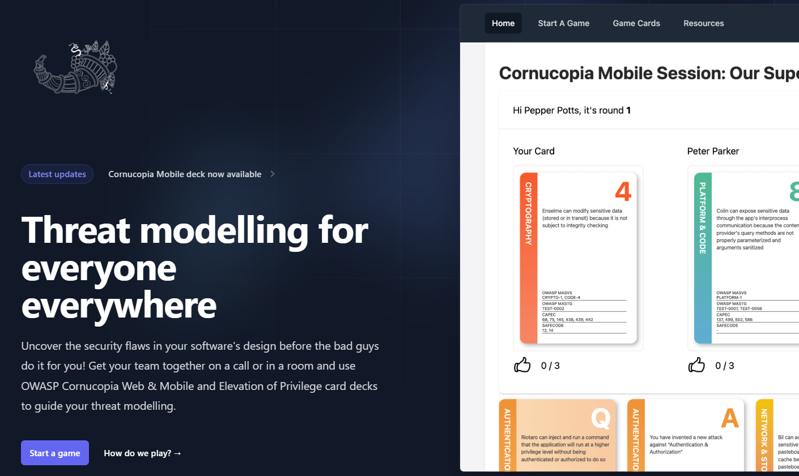

# OWASP® Cornucopia 2.2 & Copi - A Game Engine for OWASP® Cornucopia Threat Modeling

_The pandemic drove a considerable increase in fully remote teams, which made card games quite difficult to organize. Therefore, in 2022, Grant Ongers was willing to bet a dinner at a fancy vegan restaurant that his former colleague Toby Irvine wouldn't be able to build a fully fledged and online game engine based on the game Cornucopia (from the OWASP® Foundation) over the weekend._

----------------------------------------------------------------------------------------------------------------------------------------------------------------------------------------------
A weekend later, Copi was born, and Grant lost the bet. 
Built with [Elixir ](https://elixir-lang.org/)and [Phoenix](https://phoenixframework.org/), 3 years later, Copi is nearing almost 10.000 monthly users. You can read more about Toby's story on the [Secure Delivery Blog](https://securedelivery.io/articles/play-owasp-cornucopia-mobile-online/).

## A new release and new server

There is now a new release of [OWASP Cornucopia 2.2](https://github.com/OWASP/cornucopia/releases/tag/v2.2.0) to celebrate a new milestone in the project's history.
We have been able to push the application onto OWASP® Foundation’s Fly.io account so that you can enjoy the game. We have also updated the Elevation of Privilege game, which we also host, to include the cards that were missing from the original release of EoP, thanks to Adam Shostack, who made sure his game was open-sourced: https://github.com/adamshostack/eop 

Finally, if you have stringent security policies that don't allow you to use public online services, no worries, you can run [copi.owasp.org](https://copi.owasp.org "[internal]") yourself in your own account and make sure nobody can access the service. We encourage you to install '[Copi - The Cornucopia Game engine](/copi "[internal]")' and contribute to the project. Doing this is pretty straightforward. You can choose from installing it on [Heroku.com](https://Heroku.com "[external]") or [Fly.io](https://fly.io "[external]"). We Recommend [Fly.io](https://fly.io "[external]") as they support [BEAM Clustering](https://fly.io/phoenix-files/beam-clustering-made-easy/ "[external]").

![Copi - The OWASP Cornucopia Game Engine - Is free! [medium]](copi-is-free.png)

This is how you do it… 

You'll need to [install Elixir](https://github.com/OWASP/cornucopia/tree/master/copi.owasp.org#get-elixir "[external]") in order to launch the app. . Log in to [fly.io](https://fly.io/dashboard/ "[external]") and create a PostgreSQL cluster. (Click managed postgres in the menu). 1 GB of memory and 10GB of storage for the database are enough.

```bash
    git clone https://github.com/OWASP/cornucopia.git
    cd cornucopia/copi.owasp.org
    cd copi.owasp.org
    fly auth login
    fly launch --no-deploy
```

Make a note of the host, the app's name, and the PostgreSQL cluster's name. Then deploy the app from ./copi.owasp.org

```bash
    fly mpg attach <cluster name> --app <app name>
    fly deploy --app <app name> --env PHX_HOST=<app hostname without 'https://'>
    fly scale count 2 --app <app name>
```

The app will be deployed with a PostgreSQL database and two instances. The monthly cost is no more than 14$. 

Adding new card games with the same game rules as EoP or OWASP® Cornucopia is also easy. If you have any ideas and suggestions for security related card games then submit a request on [https://github.com/OWASP/cornucopia](https://github.com/OWASP/cornucopia "[external]") and please don't forget to give us a star.

## dotNET lab OWASP Cornucopia decks

Thanks to dotNET lab and Jef Meijvis, all prior decks sold on [their website](https://webshop.dotnetlab.eu/product/cornucopia-card-deck/ "[external]") now have QR codes that are redirected towards our new website. This means that if you have an old dotNET lab OWASP Cornucopia deck, then you don’t need to be afraid that your deck will become outdated when there is a new release of OWASP Cornucopia Website Edition. The QR code on the card will take you to the latest version on [cornucopia.owasp.org](https://cornucopia.owasp.org) with the newest requirement mapping.

![dotNET lab OWAS Cornucopia card [small]](card.png)

## OWASP 2025 Global AppSec EU

We will be attending the OWASP 2025 Global AppSec EU, and if you are heading there, you can join us at our [demo lab](https://sched.co/1yOiQ), where you will learn to play the game in an all-new way. Expect confetti, swag (yes, you read right, swag, valued just below the corruption limit), and illegal bribes as we venture into the dark side of OWASP Cornucopia.
We will also be showcasing OWASP Cornucopia at [the project showcase track](https://owasp2025globalappseceu.sched.com/event/1yOO3/owasp-cornucopia-scaling-secure-design-requirement-gathering-activities). If you are headed there, you may be up for a surprise. Can't wait to see you there!

![The OWASP Cornucopia Global AppSec 2025 Demo Lab [medium]](demo-lab.jpg)

----------------------------------------------------------------------------------------------------------------------------------------------------------------------------------------------
[OWASP Foundation](https://owasp.org "[external]") is a non-profit foundation that envisions a world with no more insecure software. Our mission is to be the global open community that powers secure software through education, tools, and collaboration. We maintain hundreds of open source projects, run industry-leading educational and training conferences, and meet through over 250 chapters worldwide.
