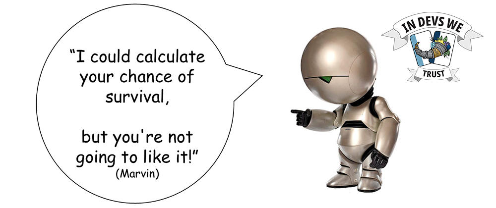

# Threat modeling your AI models using AI?

_Are you letting the AI do the threat modeling for you? There is no need to let the machines take over the world! Threat model using Elevation of MLSec on copi.owasp.org instead. Our survival depends on it! At [copi.owasp.org](copi.owasp.org) you can now play Elevation of MLSec to threat model your AI models._

----------------------------------------------------------------------------------------------------------------------------------------------------------------------------------------------

Elevation of MLsec is an unofficial Machine Learning Security (MLsec) extension of Microsoft's Elevation of Privilege threat modeling card game. These playing cards portray risks associated with machine learning (ML) that have been identified by research groups. It is suitable to play this game with or without the original Elevation of Privilege deck depending on the nature of what you're threat modeling. The intention of these cards is primarily to improve the security of ML systems themselves, as opposed to using ML for security.

The work is based mainly on [Berryville Institute for Machine Learnings (BIML)’s architectural risk analysis for machine learning systems (BIML-78)](https://berryvilleiml.com/results/ "[external]") and their LLM analysis (BIML-LLM24), found on berryvilleiml.com. The game also adds a few somewhat supplementary LLM specific threats from [OWASP’s TOP 10 list for Large Language Model](https://owasp.org/www-project-top-10-for-large-language-model-applications/ "[external]") Applications found on owasp.org.

The game was created by Elias Brattli Sørensen and designed by Jorun Kristin Bremseth while working at Kantega. You can download [the design files from their repository](https://github.com/kantega/elevation-of-mlsec "[external]") if you would like to print a physical version of the game.

Personally, I am very happy about their game and have used it myself to threat model our new AI features that we are delivering at Admincontrol, and you should do it too. Don't leave the threat modeling up to the AI or it may take over the world!

----------------------------------------------------------------------------------------------------------------------------------------------------------------------------------------------
[OWASP Foundation](https://owasp.org "[external]") is a non-profit foundation that envisions a world with no more insecure software. Our mission is to be the global open community that powers secure software through education, tools, and collaboration. We maintain hundreds of open source projects, run industry-leading educational and training conferences, and meet through over 250 chapters worldwide.
