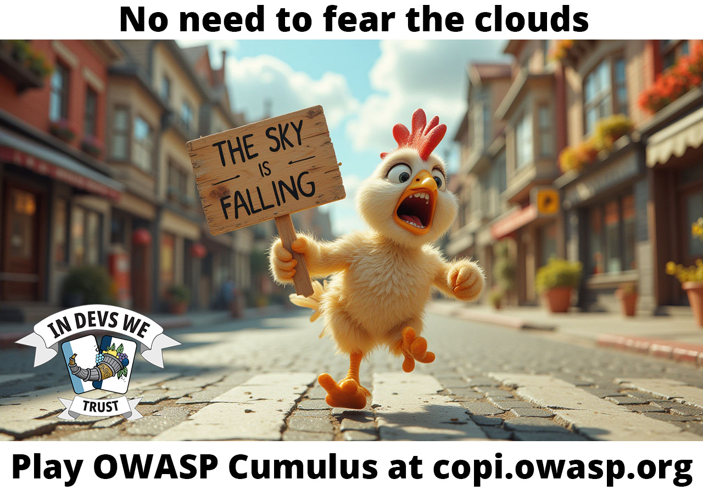
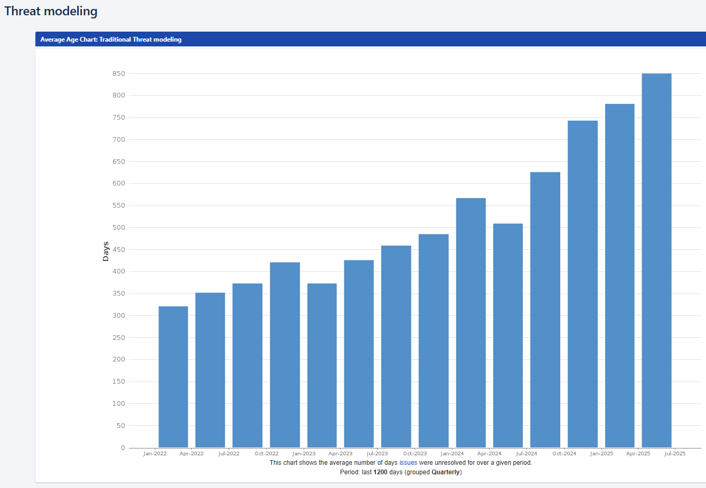
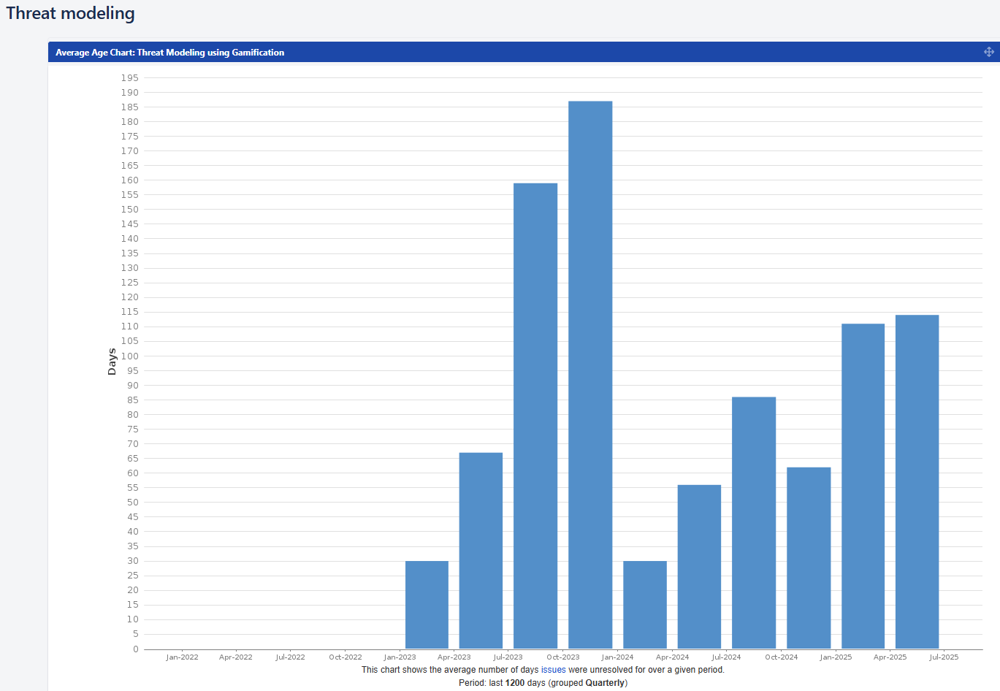

# No need to fear the clouds. Play OWASP Cumulus!

_The clouds can be a scary place. All these machines that simply aren't yours. So how can you make sure you continuously keep your cloud infrastructure secure? OWASP Cumulus is the easy way to bring security into the cloud and your devOps teams. Play it at [copi.owasp.org](https://copi.owasp.org)!_

----------------------------------------------------------------------------------------------------------------------------------------------------------------------------------------------

As a variant of the card game [Elevation of Privilege](https://shostack.org/games/elevation-of-privilege) it follows the idea to threat model a system via gamification. This lightweight and low-barrier approach helps you find threats to your devOps or cloud project and teaches the developers a security oriented mindset.

## Threat Modeling

The idea of threat modeling via serious games goes back to the card game [Elevation of Privilege](https://shostack.org/games/elevation-of-privilege "[external]") by Adam Shostack. The basic idea is to bring the developers on a table and get them start discussing the security of their system. For this, a card game serves as a guide through a catalogue of threats. It is designed to be low-barrier and naturally embeddable within agile development processes.

While we at [OWASP Cornucopia](https://cornucopia.owasp.org/) have been focusing on creating games focused on web- and mobile application security, we have felt that the specific needs of devOps team working in cloud environments have been missing. [OWASP Cumulus](https://owasp.org/www-project-cumulus/ "[external]") seeks to fill this gap and provides a custom card deck with threats to cloud systems.

## Continuously Assessing your Security 

The point here is not do just do your initial security risk assessment and be done with it, but to continuously look for new threats on a regular basis as you expand your infrastructure according to the [Threat Modeling Manifesto](https://www.threatmodelingmanifesto.org/ "[external]").

"Continuous Threat Modeling", a term described in ["Threat Modeling: A Practical Guide for Development Teams"](https://www.amazon.com/Threat-Modeling-Identification-Avoidance-Secure/dp/1492056553 "[external]") by Izar Tarandach (Author), Matthew J. Coles is essential to keep your applications and infrastructure secure as you expand them with new features and machines and increase the attack surface. Gamifications can help getting started doing just that. So why would want to continuous threat model your infrastructure and applications? Isn't it enough just to do a thorough and deep check up now and then? So we, at [Admincontrol](https://admincontrol.com/ "[external]"), thought as well!

At Admincontrol we where using threat modeling to threat model our applications. We have been having a large session that we only are able to do once a year, and several small sessions that we do for each sprint. We define Jira issues meant for mitigating these threats and assign them directly to the development team's backlog. Then we have security backlog grooming once a month with the product owners and discuss directly with them how we can get these issues resolved.

The first graph shows the resolution time for the Jira issues that are created based on the threat modeling session we do once a year. The second graph shows the resolution graph for Jira issues for the threat modeling that we do each sprint.

**Graph 1**:

**Graph 2**:

As you can see, in the first graph, the resolution time is just increasing. This is because we have Jira issues that are defined but never resolved. Some of the issues have taken close to 3 years to resolve!

The second graph shows a bump where the resolution time spikes. This is because we had a component that didn't get finalized. It stayed on the drawing bord, but the threat modeling was done so the resolution time spiked. We have no data before 2023 as we didn't do this type of threat modeling before 2023. On average, the resolution time for the short threat modeling sessions is ca. 3 months. This usually coincides with the frequency of minor releases that contain new features.

## Conclusion 

If you do long and large sessions, you run the risk of both doing threat modeling irregularly, meaning that you will have issues you never are able to solve, and having issues meant to improve the security staying in the development team's backlog forever, never to see the light of day. If you think that technical debt is scary, wait until you get to see your security debt. Not assessing how your security is doing on a regular basis isn't only very expensive, it can leave you open for threats as well. This is why continuous threat modeling is so important. Don't let your business spiral out of control, consciously assess how you are doing by continuously threat model your applications and infrastructure.

## OWASP Cornucopia

Uncover the security flaws in your software's design before the bad guys do it for you! Get your team together on a call or in a room and use OWASP Cornucopia Web & Mobile or Elevation of Privilege to guide your threat modelling at [copi.owasp.org](https://copi.owasp.org).
Now you can also secure your AI models by playing Elevation of MLSec or play OWASP Cumulus to secure your Cloud!

----------------------------------------------------------------------------------------------------------------------------------------------------------------------------------------------
[OWASP Foundation](https://owasp.org "[external]") is a non-profit foundation that envisions a world with no more insecure software. Our mission is to be the global open community that powers secure software through education, tools, and collaboration. We maintain hundreds of open source projects, run industry-leading educational and training conferences, and meet through over 250 chapters worldwide.
