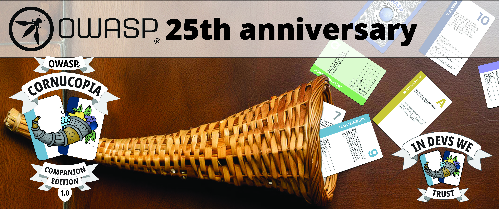

# OWASP Cornucopia Companion Edition

_OWASP Cornucopia has long stated that we will create more decks, and now we will!_
----------------------------------------------------------------------------------------------------------------------------------------------------------------------------------------------

To provide more possibilities for doing threat modeling while playing games, OWASP Cornucopia would like to welcome all OWASP members and OWASP Cornucopia enthusiasts to create the OWASP Cornucopia companion deck!

The companion deck will contain a number of optional card enhancements - each one a single suit covering a particular application security topic, and intended to be used in conjunction with the existing OWASP Cornucopia Website Edition. A suit in the companion deck may be used to replace a suit in the existing Website Edition, so that the players can add a specific focus for their threat modeling.

For example, say you are building an IoT application and want to perform threat modeling specifically for IoT. If that is the case, you can use the OWASP Cornucopia Website Edition together with the IoT companion suit as your elected OWASP Cornucopia focus area.

Each of the attacks on the cards belonging to the various suits will showcase AppSec requirements from different OWASP projects and beyond, commemorating and celebrating the 25th anniversary of the OWASP Foundation next year. In addition, we would like the case, the leaflet with the instructions, and the face of the cards to be illustrated for this very same purpose.

Join us to take gamified threat modeling to the next level and celebrate the OWASP Foundation's achievements within application security worldwide. We welcome suggestions on what the focus areas of the extension suits in the companion deck should be, which OWASP projects are most relevant for these, and contributors to write the attacks for each card. We are thinking of up to six companion deck suits. Get in touch….

Linkedin: https://www.linkedin.com/in/sydseter/

Bluesky: https://bsky.app/profile/sydseter.com

Mastadon: https://mastodon.social/@sydseter

----------------------------------------------------------------------------------------------------------------------------------------------------------------------------------------------
[OWASP Foundation](https://owasp.org "[external]") is a non-profit foundation that envisions a world with no more insecure software. Our mission is to be the global open community that powers secure software through education, tools, and collaboration. We maintain hundreds of open source projects, run industry-leading educational and training conferences, and meet through over 250 chapters worldwide.
