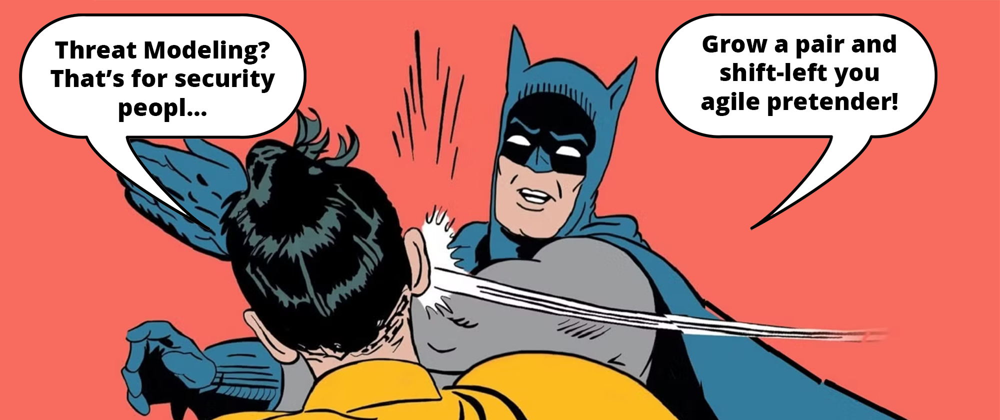
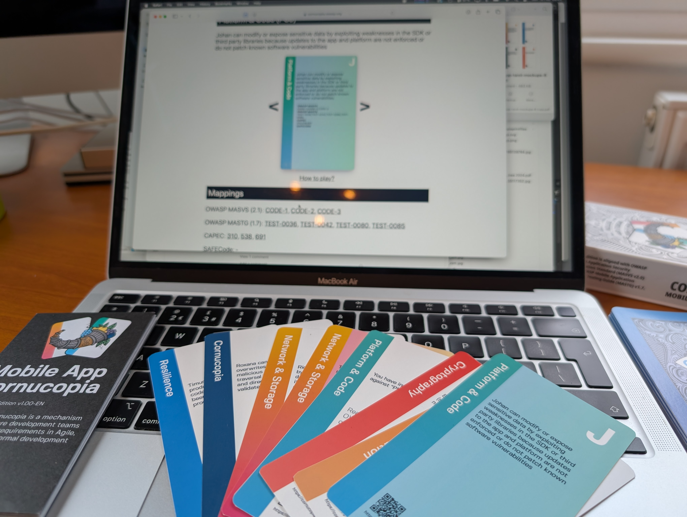
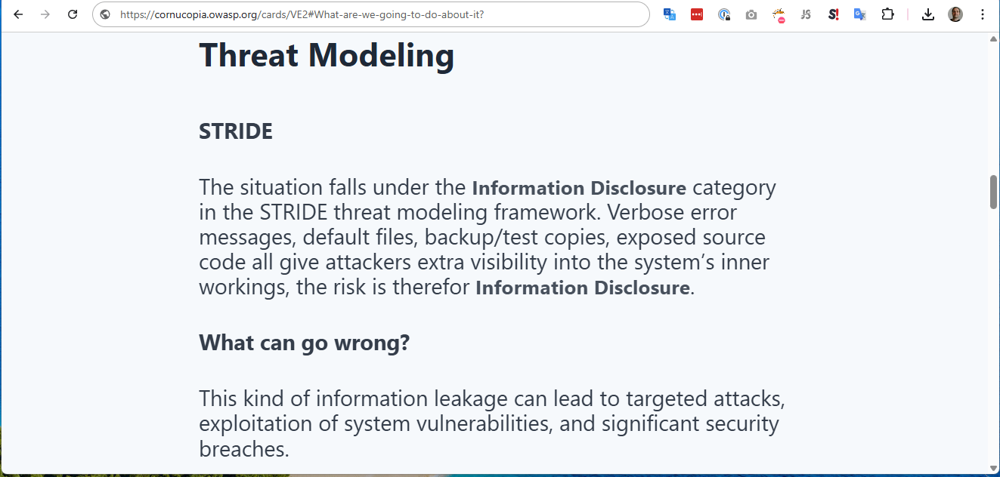
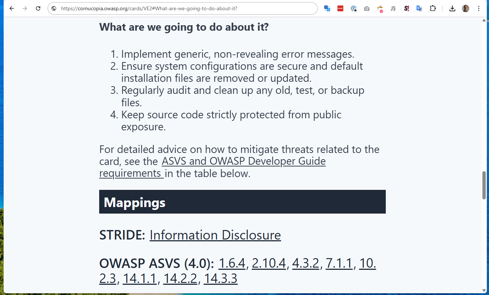

# OWASP Cornucopia Website Edition v2.2

_Shift-left doesn't start with scanning the code for security vulnerabilities; it begins with designing it. Play yourself secure with OWASP Cornucopia Website Edition v2.2_

---

To often the shift-left mantra consists of implementing AI code scanning and AI-generated patches for remediation. Also, don't forget to implement the [AI-powered benchmark for AI-Powered Security Fixes](https://engineering.fb.com/2025/04/29/ai-research/autopatchbench-benchmark-ai-powered-security-fixes/). We're not telling you to stop using these tools, we want you to ask yourself (to paraphrase [Adam Shostack's 4 question frame for threat modeling](https://github.com/adamshostack/4QuestionFrame)):

- What are you working on?
- What can go wrong?
- What are you going to do about it?
- And whether you have done a good job?

Secure design starts with understanding what you are doing, asking what can go wrong and what to do about it. I'll leave that to the AI-assistants you say?
Before you do, know that the "[2025 GenAI Code Security Report](https://www.veracode.com/blog/ai-generated-code-security-risks/)" from Veracode shows that after a comprehensive analysis of over 100 large language models across 80 coding tasks spanning four programming languages and four critical vulnerability types, only 55% of AI-generated code was secure (AI-Generated Code: A Double-Edged Sword for Developers, 09.09.2025). We don't doubt that, eventually, the machines will take over the world, but in the mean time, don't forget to ask yourself what can go wrong.

And what does the industry standard for infosec management say about writing secure code?

If you happen to be ISO 27001 certified and are writing code, you should know that the control you have called: "ISO 27002: 8.28 Secure coding", says that: "Planning and prerequisites before coding should include: ... g) secure design and architecture, including threat modelling".

But, how can you possible do that in an agile and fun way?

Visit [copi.owasp.org](https://copi.owasp.org) and play OWASP Cornucopia, Elevation of MLSec, Elevation of Privilege or OWASP Cumulus with your team.
Games aren't just for fun, they can be serious tools too, and that is what we are doing with [OWASP Cornucopia](https://cornucopia.owasp.org/). We are making threat modeling for everyone, everywhere, and we have a special love for agile teams that want to do continuous threat modeling as part of their development sprints. Don't believe us? See how long-time project contributor Max Alejandro Gómez Sánchez Vergaray has [created a video](https://cornucopia.owasp.org/how-to-play#Gameplay-using-abuse-case-modelling-approach) to explain how he has trained hundreds of teams to use OWASP Cornucopia in abuse case modelling sessions at a major international bank. This approach has scaled to over two-thousand developers to date.

---

<noscript>
    
You cannot view this video directly because JavaScript is disabled. Click <a href="https://www.youtube.com/watch?v=XXTPXozIHow" title="How to play OWASP Cornucopia" target="_blank" rel="noopener">here</a> to watch the video on YouTube.

</noscript>
<iframe credentialless anonymous class="how-to-play" frameborder="0" title="Youtube: How to play OWASP Cornucopia"
src="https://www.youtube.com/embed/vLYzId7-ijI?si=yh4vHK7VfO9a5l6s" referrerpolicy="no-referrer" allowfullscreen >

You cannot view this video directly because iframes are disabled. Click <a href="https://www.youtube.com/watch?v=vLYzId7-ijI" title="How to play OWASP Cornucopia" target="_blank" rel="noopener">here</a> to watch the video on YouTube.
</iframe>

---

In our next version of OWASP Cornucopia Website App Edition version 2.2 we have a special threat for you. We have gathered together all our threat modeling expertise, created threat modeling scenarios for each card and analyzed which STRIDE categories each of these scenarios belong to. If you have bought a [OWASP Cornucopia deck with QR codes from cybersecgames.com](https://cybersecgames.com/products/owasp-cornucopia-2-1-website-app-edition-threat-modeling-cards?variant=55622568903043) you can now give your team advice on threat scenarios, threat vectors, attack patterns, mitigation strategies and STRIDE when playing the game by letting them scan the QR codes on each card. Each scenario follows "[Shostack's Four Question Frame for Threat Modeling](https://github.com/adamshostack/4QuestionFrame?tab=readme-ov-file#shostacks-four-question-frame-for-threat-modeling)" making it easy for your security champions to come up with the threats and mitigations themselves.
In addition, we have added additional CAPEC's that corresponds to each card and added references to the [OWASP Developer Guide's Web Application Checklist](https://devguide.owasp.org/en/04-design/02-web-app-checklist/) that will link your threat modeling to OWASP secure coding practices and the [OWASP Top 10 Proactive controls](https://top10proactive.owasp.org/), this, thanks to Jon Gadson from the OWASP Developer Guide project.

We are just getting started, in fact, this is just the 1. step. We will continue to bring threat modeling to everyone, everywhere, and will continue to do so in the time to come.

## How to use OWASP Cornucopia cards together with the OWASP Cornucopia website

### Preparations

1. Identify an application or application process to review; this might be a concept, design or an actual implementation
2. Ask: "What are we working on?" By bringing a data flow diagram, or making one!
3. Invite a group of 3-6 people on your team who know what's been built, or what's going to be built, inside out
4. Have some prizes to hand (gold stars, chocolate, pizza, beer, flowers, whatever you need)

### Play

1. Create a game in [Copi](https://copi.owasp.org/games/new) or use a [OWASP Cornucopia deck with QR codes from cybersecgames.com](https://cybersecgames.com/products/owasp-cornucopia-2-1-website-app-edition-threat-modeling-cards?variant=55622568903043)
2. If you are using Copi, Share the link to the game page with everyone playing or watching
3. Players can click the button to join as a player
4. Once at least 3 players have joined you can start the game (make sure all your players have joined!)
5. Click the Start Game button and Copi will shuffle and deal out the cards
6. To begin, choose a player randomly who will play the first card - they can play any card from their hand except from the trump suit - Cornucopia
7. Once a card is played, the player must read it out aloud, and explain how (or not) the threat could apply (the player gets a point for attacks that work, and the group thinks it is an actionable bug) - don’t try to think of mitigations at this stage, and don’t exclude a threat just because it is believed it is already mitigated - someone record the card on the score sheet
8. If someone gets stuck, asked them to use the QR codes on the cards, in case you use physical cards, or the buttons on the cards, in case you use Copi. Tell them to read the [STRIDE](https://cornucopia.owasp.org/cards/VE2#STRIDE)- and "[What can go wrong?](https://cornucopia.owasp.org/cards/VE2#What-can-go-wrong?)" section of the card they think is more likely to be a threat. Discuss what the section says, click further on the links to the [CAPEC™ cross-references](https://cornucopia.owasp.org/cards/VE2#mapping)  for further advice on possible attack patterns. 
9. Each player must play a card in the same way; if you have any card of the matching lead suit you must play one of those, otherwise they can play a card from any other suit. Only a higher card of the same suit, or the highest card in the trump suit Cornucopia, wins the round
10. To win the round the players have to vote. The highest card that is voted on by 2 or more players takes the trick and wins the round, but every card that gets 2 or more votes get a point.
11. The player who wins the round, leads the next round (i.e., they play first), and thus define the next lead suit
12. Before moving to the next round, ask the players "what are we going to do about" the threats they have found. If they don't know, asked them to use the QR codes on the cards, in case you use physical cards, or the buttons on the cards, in case you use Copi. Tell them to read the ["What are we going to do about it?"](https://cornucopia.owasp.org/cards/VE2#What-are-we-going-to-do-about-it?) section of the cards that have scored points. Discuss what the section says, click further on the links to the [ASVS- and OWASP DevGuide cross-references](https://cornucopia.owasp.org/cards/VE2#mapping) for further advice and note which OWASP Cheat sheet pages may bee helpful. 
13. Create tasks in you Issue Tracker Software and/or threat model!
Repeat until all the cards are played

---

Uncover the security flaws in your software's design before the bad guys do it for you! Get your team together on a call or in a room and use OWASP Cornucopia Web & Mobile, Elevation of Privilege or Elevation of MLSec and OWASP Cumulus to secure your AI models and Cloud infrastructure respectively and guide your threat modelling at [copi.owasp.org](https://copi.owasp.org), and if you visit our [code repository](https://github.com/OWASP/cornucopia) please give us a star ⭐️.

<noscript>
    
You cannot view this video directly because JavaScript is disabled. Click <a href="https://www.youtube.com/watch?v=XXTPXozIHow" title="How to play OWASP Cornucopia" target="_blank" rel="noopener">here</a> to watch the video on YouTube.

</noscript>
<iframe credentialless anonymous class="how-to-play" frameborder="0" title="Youtube: How to play OWASP Cornucopia"
src="https://www.youtube.com/embed/XXTPXozIHow?si=uIi_VXDtSBkS027S" referrerpolicy="no-referrer" allowfullscreen >

You cannot view this video directly because iframes are disabled. Click <a href="https://www.youtube.com/watch?v=XXTPXozIHow" title="How to play OWASP Cornucopia" target="_blank" rel="noopener">here</a> to watch the video on YouTube.
</iframe>

---

[OWASP Foundation](https://owasp.org "[external]") is a non-profit foundation that envisions a world with no more insecure software. Our mission is to be the global open community that powers secure software through education, tools, and collaboration. We maintain hundreds of open source projects, run industry-leading educational and training conferences, and meet through over 250 chapters worldwide.
