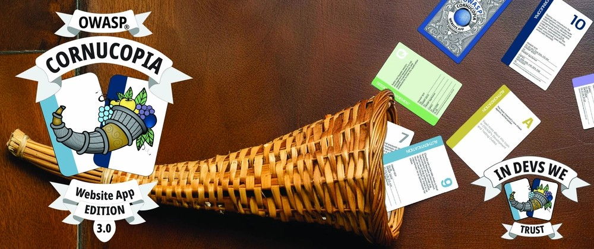

# OWASP Cornucopia 3.0 - A call for card game designers!

_Would you like to be our card game designer for the OWASP Cornucopia Website Edition v3.0?_

---

We are close to releasing the next version of [OWASP Cornucopia Website Edition v3.0](https://cornucopia.owasp.org/cards)

Are there some brilliant designers out there who would like to volunteer to create the motifs for the 80 cards in OWASP's very popular threat modeling card games for website applications?

OWASP® Cornucopia is a threat modeling tool in the form of a card game to assist software development teams in identifying security requirements in Agile, conventional, and formal development processes. It strives to be language, platform, and technology-agnostic.

It’s one of the few tools that connects threat modeling with OWASP ASVS, SAFECode, STRIDE, OWASP DevGuide, and CAPEC, helping to identify security requirements, develop a secure design, and create a threat model without prior knowledge of these frameworks. 

We are now creating the next version of the website app game. The new version will feature new cards and text that cover all of the requirements in OWASP ASVS 5.0 and connect these to more than 210 unique common attack patterns (CAPEC).

The first edition was created in August 2012, released as v1.0 in February 2013, and has undergone several minor updates/releases over the subsequent ten years. This has been substantially updated in today’s release of v3.0, with the most noticeable change being the update of the OWASP ASVS mapping from ASVS v4.0 to v5.0. The card game comes in two physical sizes. The smaller ones are often referred to as “bridge-sized cards” and the larger ones as “Tarot-sized cards”. All these v3.0 files will be immediately available in nine languages (English, Spanish, French, Dutch, Norwegian, Portuguese, Italian, Russian, and Hungarian) due to the efforts of past and current volunteers.

Don't hesitate to get in touch [with us](https://www.linkedin.com/in/sydseter/) for fame and glory.

---

Uncover the security flaws in your software's design before the bad guys do it for you! Get your team together on a call or in a room and use OWASP Cornucopia Web & Mobile, Elevation of Privilege or Elevation of MLSec and OWASP Cumulus to secure your AI models and Cloud infrastructure respectively and guide your threat modelling at [copi.owasp.org](https://copi.owasp.org), and if you visit our [code repository](https://github.com/OWASP/cornucopia) please give us a star ⭐️.

<noscript>
    
You cannot view this video directly because JavaScript is disabled. Click <a href="https://www.youtube.com/watch?v=XXTPXozIHow" title="How to play OWASP Cornucopia" target="_blank" rel="noopener">here</a> to watch the video on YouTube.

</noscript>
<iframe credentialless anonymous class="how-to-play" frameborder="0" title="Youtube: How to play OWASP Cornucopia"
src="https://www.youtube.com/embed/XXTPXozIHow?si=uIi_VXDtSBkS027S" referrerpolicy="no-referrer" allowfullscreen >

You cannot view this video directly because iframes are disabled. Click <a href="https://www.youtube.com/watch?v=XXTPXozIHow" title="How to play OWASP Cornucopia" target="_blank" rel="noopener">here</a> to watch the video on YouTube.
</iframe>

---

[OWASP Foundation](https://owasp.org "[external]") is a non-profit foundation that envisions a world with no more insecure software. Our mission is to be the global open community that powers secure software through education, tools, and collaboration. We maintain hundreds of open source projects, run industry-leading educational and training conferences, and meet through over 250 chapters worldwide.
