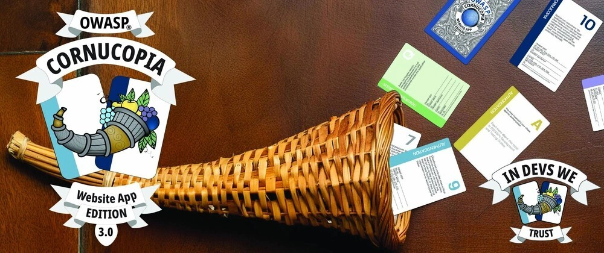
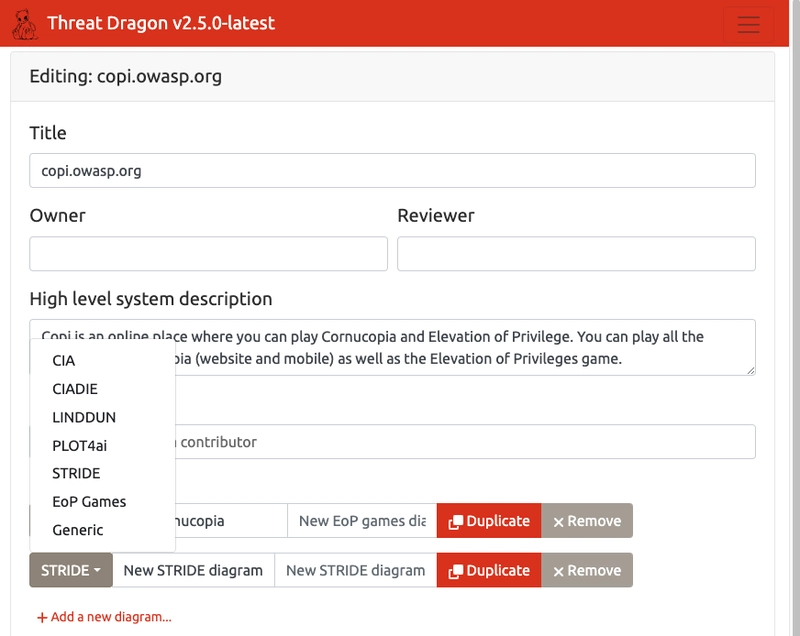
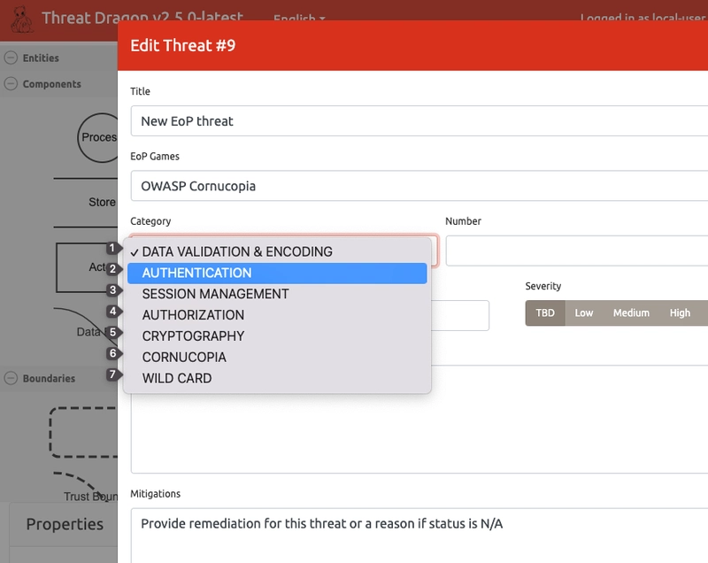
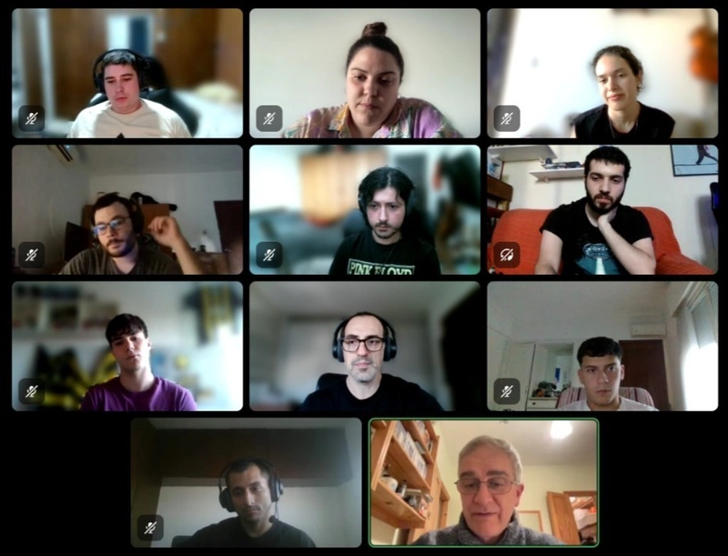
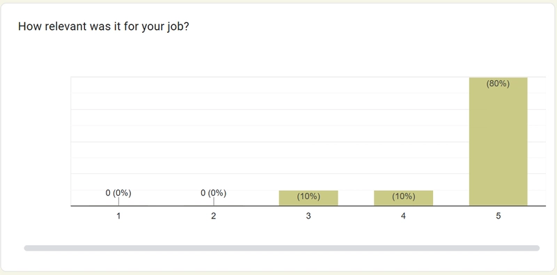

# The Cornucopia of Gamified Threat Modeling

__At the OWASP Cornucopia project, we are done with updating the cards and help pages for the Website App Edition v3.0: [https://cornucopia.owasp.org/edition/webapp/VE2/3.0](https://cornucopia.owasp.org/edition/webapp/VE2/3.0)__

We would like to thank everyone who contributed to the translations for the new version of the card game and welcome you to review the text on the help pages themselves. Are there inconsistencies? Is there something you feel should be added or removed? If you find anything, please don't hesitate to contact us or raise an issue. Each page includes a "View source on GitHub" button that lets you quickly edit the text if you aren't pleased with it. All viewpoints and critiques are welcome as we are trying to create a home for gamified threat modelling.

The new Website App Edition v3.0, available in 10 languages (EN, ES, FR, HI, NL, NO-NB, PT-PT,  PT-BR, RU, UK), connects 202 CAPECs individually to a set of ASVS 5.0 requirements in relation to each of the cards. This means, even though you only have 80 cards, the website describes an exponential number of possible threats, making it the Cornucopia of website app threats. There is simply no end to the possibilities that your thoughts can take you while playing the game, yes, that's the Cornucopia way.
But what if you want to focus on a specific CAPEC and find the related OWASP ASVS requirements? 
Go to a card, click on the CAPEC in the CAPEC map, and it will give you all the possible OWASP ASVS combinations, thereby connecting attack patterns and security requirements, making a thorough and deep website security requirement analysis possible while discussing a specific card. You can literally spend weeks analysing, playing, deciding for yourself "What can go wrong?", "What to do about it?", and even form yourself an opinion on whether you really did a good job (see: [Shostack's Four Question Frame for Threat Modeling](https://github.com/adamshostack/4QuestionFrame)).

Have we stopped there? Now we haven't! For each card, you also have the "OWASP Cheat Sheet Series Index". What is that? The "OWASP Cheat Sheet Series Index" is an OWASP index that connects each of the ASVS requirements with a set of OWASP Cheat Sheets that will give you advice on how to implement the specific OWASP ASVS requirement! Want to know how to do log protection according to "OWASP ASVS V16.4 - Log Protection"? No problem! The "OWASP ASVS (5.0) Cheat Sheet Series Index" displayed on the help pages for each card will take you to the collection of OWASP Cheat Sheets that is related to the requirement you are wondering about.

But there is even more! What about STRIDE? What about Threat Modeling? Each card has a [STRIDE section](https://cornucopia.owasp.org/edition/webapp/VE2/3.0#STRIDE), a ["What can go wrong?"](https://cornucopia.owasp.org/edition/webapp/VE2/3.0#What-can-go-wrong?) section and a ["What are we going to do about it?"](https://cornucopia.owasp.org/edition/webapp/VE2/3.0#What-are-we-going-to-do-about-it?) section. 

This means that during your threat modeling, if you have questions about ["What can go wrong?"](https://cornucopia.owasp.org/edition/webapp/VE2/3.0#What-can-go-wrong?) or ["What are we going to do about it?"](https://cornucopia.owasp.org/edition/webapp/VE2/3.0#What-are-we-going-to-do-about-it?) Just go to the individual card pages, and you will find what you are looking for!

Now, you may be asking yourself, "That's it, right? No, it isn't we have even mooore! 

## Threat Dragon and EoP Games

When choosing a tool for publishing our threat model, we chose [OWASP Threat Dragon](https://www.threatdragon.com/#/). OWASP Threat Dragon is a free, open-source, cross-platform threat modeling application. It is used to create threat modeling diagrams and list threats for elements within the diagrams. Mike Goodwin created Threat Dragon as an open-source community project that provides an intuitive, accessible way to model threats.

OWASP Threat Dragon has released this possibility in v2.6. This is just the start of integration between the two projects.

Thanks to Gerardo Canedo and his students at Universidad Católica del Uruguay, it's now possible to create your OWASP Cornucopia Threat Model directly in OWASP Threat Dragon. When creating a new diagram for your threat model, simply choose to create an EoP Games diagram. We chose to call the diagram EoP Games for two reasons. One, OWASP Cornucopia is derived from the [Elevation of Privilege game](https://shostack.org/games/elevation-of-privilege) created by Adam Shostack. Two, we don't want to stop with OWASP Cornucopia. We also want to add other EoP games, such as the original EoP Game.

Once you have created an EoP Games diagram, you can add OWASP Cornucopia threats to your threat model. The specific threat you add will get a link reference to the [OWASP Cornucopia website](https://cornucopia.owasp.org/edition/webapp/AT3/2.2/en#Threat-Modeling), where you will find guidance on threat modeling and STRIDE, which will help you in identifying what can go wrong and what to do about it. You can also find a [complete mapping](https://cornucopia.owasp.org/edition/webapp/AT3/2.2/en#What-are-we-going-to-do-about-it?) to [OWASP ASVS](https://cornucopia.owasp.org/taxonomy/asvs-4.0.3/02-authentication/05-credential-recovery#V2.5.2), [OWASP Developer Guide](https://devguide.owasp.org/en/04-design/02-web-app-checklist/06-digital-identity/#1-authentication-a), and all [relevant CAPECs](https://cornucopia.owasp.org/taxonomy/capec-3.9).

I want to express my sincere appreciation to Gerardo Canedo, Sebastian Feirres, and their students at Universidad Católica del Uruguay for making this possible. With their dedication and effort, OWASP Cornucopia wouldn’t have had this possibility.

## Shostack's 4 Question Frame for Threat Modeling

OWASP Cornucopia, together with OWASP Threat Dragon, is helping us in answering:

- What we are working on
- What can go wrong?
- What are we going to do about it?

...but "Did we do a good enough job?"

At Admincontrol, where I work, we have always sent an anonymous survey after every OWASP Cornucopia threat modeling session. The aggregate score for how satisfied respondents have been with all sessions we've held since we started OWASP Cornucopia in 2023 is 4.5 out of 5. When asked how relevant the session was to the participant's job, the average score was 4.7 out of 5. When asked whether the OWASP Cornucopia session helped the participants understand which security controls (mitigations) they need to implement/test, the score was 4.5. When asked whether the session improved the overall awareness of application security requirements, the score was 4.0. When asked, "Did we do a good job?", the score was 4.3. So for sure, we can do better!

When asking the question, "Did we do a good enough job?", don’t just blurt it out during a session. Do you honestly think people will give you their honest criticism to your face directly? Send out an anonymous survey and ask for feedback!

## How to get those requirements into your issue tracking software

So you have done your threat modeling and security requirement analysis, what comes next? You need to create an issue that the development team can work on, and you need to add it to the development team's sprint. How do you do it? 
The OWASP Cornucopia project is creating a [requirements API](https://cornucopia.owasp.org/api/docs) that lets you harvest the security requirements you want. After you have created your threat model in OWASP Threat Dragon, extract its JSON response, look up the threats you have identified, and find the corresponding security requirements by using the API, merge the results together, and generate your [evil user stories](https://cornucopia.owasp.org/how-to-play#Gameplay---Modelling-evil-user-stories) by pushing the results to your issue tracking software just in time for the development team's next sprint.

## How to get OWASP Cornucopia?

The question you might be asking yourself is, "How are we going to be able to utilize these resources and play this game?" No problem! There are various ways you can do that, both online at [copi.owasp.org](https://copi.owasp.org/) and in person, enjoying the presence of your colleagues, by [buying a deck of cards](https://cybersecgames.com/products/owasp%C2%AE-cornucopia-3-0-website-app-edition-threat-modeling-cards-copy).

## What is coming next...

But what about DevOps? What about LLM and AI Agents? We are working on that too. The new [OWASP Cornucopia Companion Edition](https://cornucopia.owasp.org/edition/companion), that soon will be published, can be used alongside the OWASP Website App Edition and it comes with 6 new companion suits covering new topics: Agentic AI (AAI), Automated Threats (BOT), Cloud (CLD), Frontend (FRE), Large Language Models (LLM), and  DevOps (DVO). A suit in the companion deck may replace (or be used in addition to) suites in the existing Website Edition so that the players can add a specific focus to their threat modeling: For example, say you are building an LLM application and want to perform threat modeling specifically for LLM. You would then use the OWASP Cornucopia Website Edition and the LLM companion suite as your elected OWASP Cornucopia focus area.

OWASP Cornucopia welcomes any input or improvements you might be willing to share with us. For anyone wanting to share their opinion, please don't hesitate to [visit our repository](https://github.com/OWASP/cornucopia/issues), share your feedback, and, if appropriate, give us a star⭐️.

<noscript>
    
You cannot view this video directly because JavaScript is disabled. Click <a href="https://www.youtube.com/watch?v=XXTPXozIHow" title="How to play OWASP Cornucopia" target="_blank" rel="noopener">here</a> to watch the video on YouTube.

</noscript>
<iframe credentialless anonymous class="how-to-play" frameborder="0" title="Youtube: How to play OWASP Cornucopia"
src="https://www.youtube.com/embed/XXTPXozIHow?si=uIi_VXDtSBkS027S" referrerpolicy="strict-origin-when-cross-origin" allowfullscreen >

You cannot view this video directly because iframes are disabled. Click <a href="https://www.youtube.com/watch?v=XXTPXozIHow" title="How to play OWASP Cornucopia" target="_blank" rel="noopener">here</a> to watch the video on YouTube.
</iframe>

---

[OWASP Foundation](https://owasp.org "[external]") is a non-profit foundation that envisions a world with no more insecure software. Our mission is to be the global open community that powers secure software through education, tools, and collaboration. We maintain hundreds of open source projects, run industry-leading educational and training conferences, and meet through over 250 chapters worldwide.
