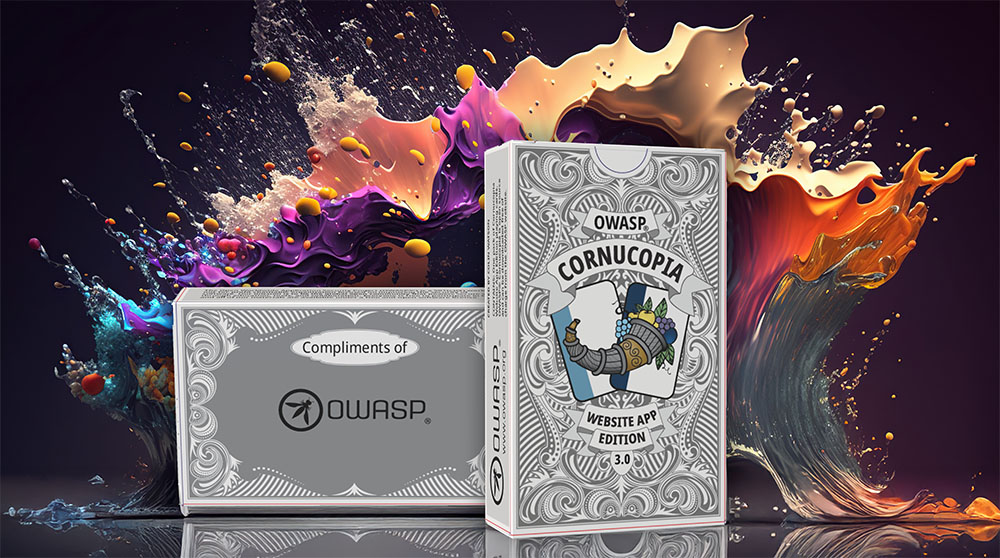
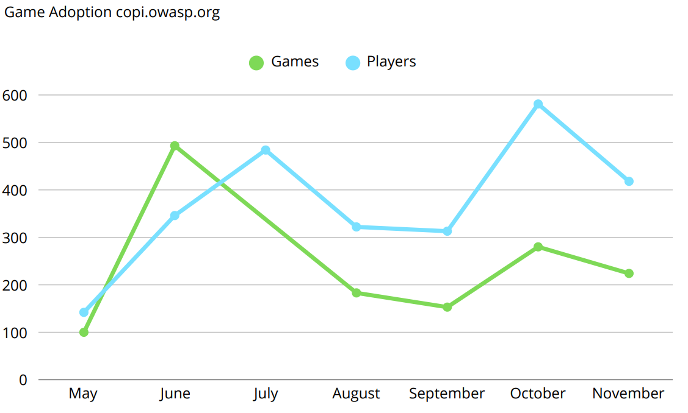
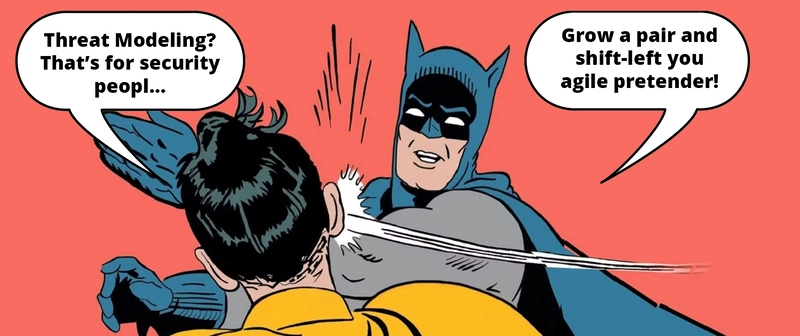
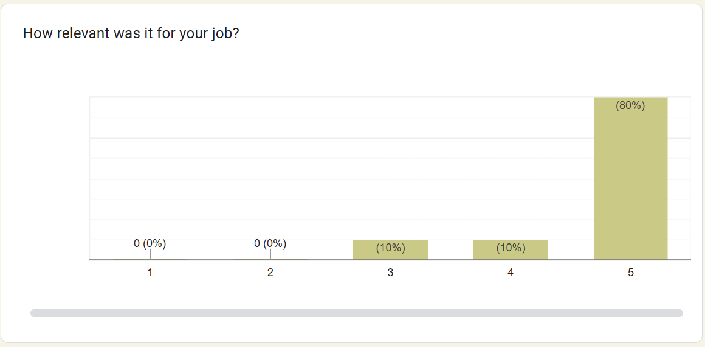
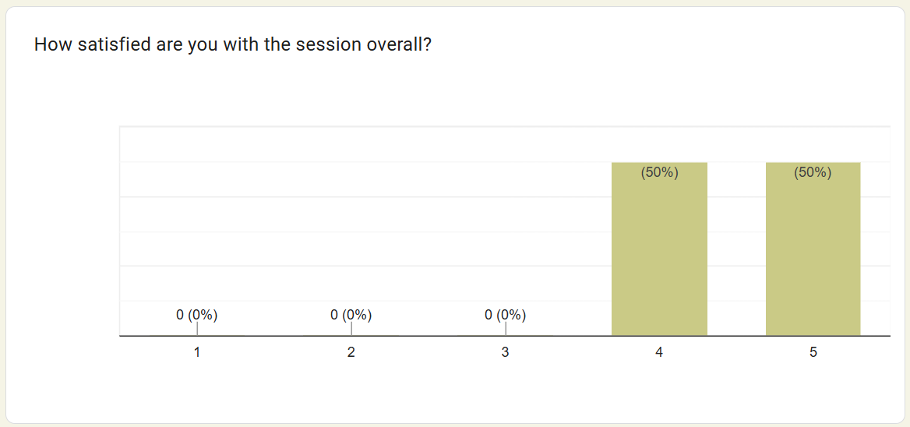
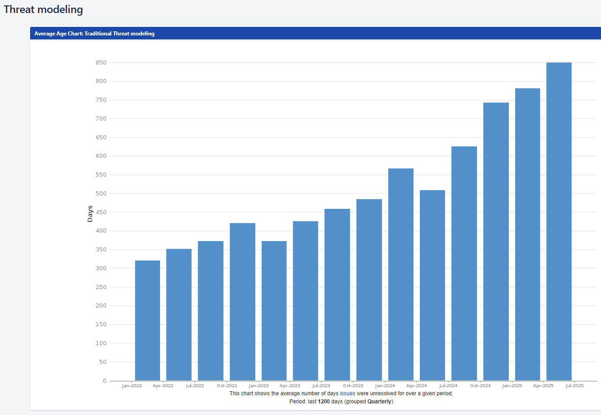
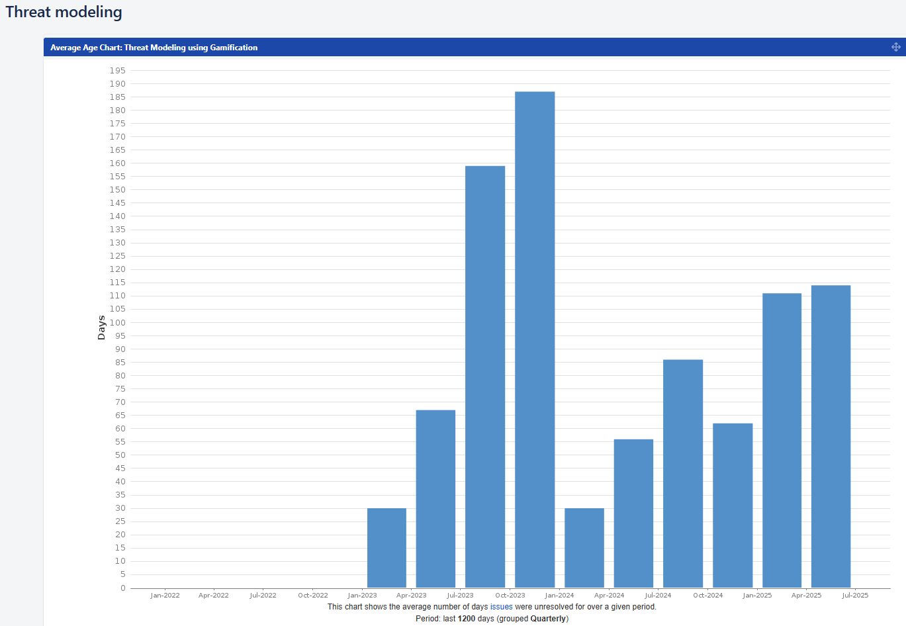

# Introducing OWASP Games for threat modeling Agentic AI, Cloud, DevOps, LLM, Automation, and Web

__Shift-left doesn't start with scanning the code for security vulnerabilities; it begins with designing for security.__

Too often, the shift-left mantra consists of implementing (AI-powered) code scanning and applying AI-powered security fixes for remediation. Also, don't forget to implement the AI-powered benchmark for AI-powered Security Fixes. Now, to be clear, I am not actually telling you to stop using these tools — if they work for you — instead, we should ask ourselves:

- What are we working on?
- What can go wrong?
- What are we going to do about it?
- Did we do a good job?

## OWASP Cornucopia v3.0

In order to support that second question in particular, we have released the next version of [OWASP Cornucopia v3.0](https://github.com/OWASP/cornucopia/releases/tag/v3.0.0)
. If you would like to buy a professional physical copy of v3.0, you can do so at [CyberSec Games](https://cybersecgames.com/collections/threat-modeling-games/products/owasp%C2%AE-cornucopia-3-0-website-app-edition-threat-modeling-cards-copy). You can also download the design files from the release and take them to your local printer or print them yourself.

[OWASP Cornucopia](https://cornucopia.owasp.org/about) is a mechanism in the form of a card game to assist software development teams in identifying security requirements in Agile, conventional, and formal development processes. It is language, platform, and technology-agnostic.
The formerly titled “Cornucopia — Ecommerce Website Edition” is now “Cornucopia — Website App Edition”. This edition was originally created in August 2012, released as v1.0 in February 2013, and has undergone several minor updates/releases over the following ten to fifteen years. This has been substantially updated in v2.0, in which the most noticeable change was an update of the OWASP ASVS mapping from ASVS v3.0 to v4.0, together with the creation of translations into six languages (EN, ES, FR, NL, NO-NB, and PT-BR) due to the efforts of past and current volunteers.

The new version, available in 11 languages (EN, ES, FR, HI, NL, NO-NB, PT-PT, PT-BR, RU, UK, HI), includes all new cards and text that covers all OWASP ASVS 5.0 requirements and links them to more than [200 unique common attack patterns (CAPEC™)](https://cornucopia.owasp.org/edition/webapp/VEK/3.0/en#Mappings). Each of the common attack patterns will have a unique set of ASVS 5.0 requirements, which means that you never need to stop playing the game! You will always be able to return to the same card to discover new threats and security requirements to consider when building your software; that's the Cornucopia way.

We have also [created an API](https://cornucopia.owasp.org/api/docs) where you can find, programmatically, all requirements connected to each card together with a complete mapping between CAPECs and ASVS 5.0 requirements so that you can automate your threat modeling and requirement analysis processes. If you want to know more about the latest additions to the Website App Edition v3.0, read all about it on our blog post "[The Cornucopia of Gamified Threat Modeling](https://dev.to/owasp/the-cornucopia-of-gamified-threat-modeling-1c9k)"

## OWASP Cornucopia Companion Edition v1.0

Now, we are publishing the [OWASP Cornucopia Companion Edition](https://cornucopia.owasp.org/edition/companion) that comes with 6 companion suits (see: https://cornucopia.owasp.org/edition/companion) covering new topics: Agentic AI (AAI), Automated Threats (BOT), Cloud (CLD), Frontend (FRE), Large Language Models (LLM), and DevOps (DVO). A suit in the companion deck may replace (or be used in addition to) suites in the existing Website Edition so that the players can add a specific focus to their threat modeling: For example, say you are building an LLM application and want to perform threat modeling and security requirement analysis specifically for LLM. You would then use the OWASP Cornucopia Website Edition and the LLM companion suite as your elected OWASP Cornucopia focus area. The new version is immediately available online at [copi.owasp.org](https://copi.owasp.org) and for sale at [CyberSec Games](https://cybersecgames.com/). You can also download the design files from [the latest release](https://github.com/OWASP/cornucopia/releases/tag/v3.0.0).

To commemorate the OWASP Foundation's 25th anniversary, we have also designed the case, leaflet, and cards specifically to celebrate the anniversary and OWASP's achievements within the field of application security and software engineering. We will also be attending the OWASP Global AppSec 2026 in Vienna, where we will be demoing the game for anyone who wants to come and play with us.

We feel this is only the start; each year, OWASP Cornucopia resellers distribute 1,000 games to teams worldwide. At copi.owasp.org, more than 500 users conduct threat modeling for mobile applications, agentic AI, automated threats, cloud, identity management, large language models, and SDL processes every month. In the coming time, we at OWASP Cornucopia will work towards promoting threat modeling and games to change the security culture at software companies worldwide.

## Why a companion edition?

The time when development teams could focus only on web development is long gone. Modern software development and sprint planning often include implementing integrations towards large language models, AI agents, and DevOps pipelines through full-stack development. In such an environment, security requirements are constantly shifting from sprint to sprint. Therefore, the only possibility is choosing an agile and collaborative approach to threat modeling that supports including a large number of people with various backgrounds, experiences, and knowledge.
The OWASP Cornucopia Companion Edition was created to accommodate this. A big, beautiful Excel document can never replace a collaborative approach to threat modeling that includes the opinions of everyone on the development team. To avoid having the threat modeling and security design processes become an exercise in superficial ISO compliance, you need to empower your development teams to work together to come up with a secure design. Such a process requires ingenuity, to think out of the box, and to make unpopular decisions that may affect the delivery schedule of a development project. Neither an Excel document nor an ISO 27001 policy will ever get a development team to do that.

Failing to regularly assess your security isn't only costly; it can leave you vulnerable to threats. Several companies have implemented OWASP Cornucopia as part of their SDLC and use it for security requirements analysis, threat modeling, and secure design for every sprint and every user story. You should do the same! Don't let your business spiral out of control; consciously assess how you are doing by continuously threat-modeling your applications and infrastructure. To get started scaling your threat modeling efforts, OWASP Cornucopia and its companion edition are the perfect tools.

We want to thank all project leaders and contributors to the OWASP projects who have provided valuable input and guidance on the OWASP Top 10, OWASP AISVS, OWASP MAS, OWASP Cumulus, OWASP Threat Dragon and the OWASP GenAI Security project. It's thanks to these projects, and many more, that we can deliver to you the OWASP gamified approach to threat modeling and requirement analysis.
We also want to thank the people and contributors to Mitre's Common Attack Pattern Enumeration and Classification (CAPEC™) and Atlas, together with CSA Cloud Controls Matrix, which are all used in the cross-references provided.

## Walk that walk, talk that talk

With the next version of OWASP Cornucopia, we are making it more than a game; it has become a fully fledged threat modeling tool. It doesn’t just feed into your threat modeling process; it drives it, and it doesn’t just work; it scales! A long-time project contributor, previously working at Banco de Crédito BCP, used OWASP Cornucopia to train hundreds of people in using [OWASP Cornucopia for threat modeling](https://cybersecgames.com/blogs/case-studies/identifying-abuse-before-designing-architecture-embedding-game-based-threat-modelling-into-agile-delivery-at-a-major-latin-american-bank).
Several companies, such as Admincontrol AS, a Euronext subsidiary, are using it as part of their custom development methodology and have made it the [primary mechanism for structured threat elicitation](https://cybersecgames.com/blogs/case-studies/case-study-scaling-threat-modelling-through-gamification-at-admincontrol). 

"Continuous Gamified threat modeling", done the OWASP way, has been tested and proven to work and is generally welcomed by ISO auditors. Not only is it welcomed, but auditors also love to hear about how it can be used to create engagement and change the culture of the companies that make use of it. This, according to Admincontrol, which has been audited 4 times using all 97 controls from ISO 27001/27002 as part of their information security management system. "Continuous Gamified Threat Modeling" is about assisting software development teams in identifying security requirements in Agile, conventional, and formal development processes through continuous gamification and threat modeling for every feature and every release. Don't apologize for designing before coding, it's called thinking!

And the developers? They love it! At Admincontrol, we always send out an anonymous survey to gather team feedback.
The aggregate score for how satisfied respondents have been with all sessions we've held since we started OWASP Cornucopia in 2023 is 4.5 out of 5, which is the maximum. When asked how relevant the session was to the participant's job, the average score was 4.7 out of 5.

The point here is not just to do your initial security risk assessment and be done with it, but to continuously look for new threats as you improve your software, in line with the [Threat Modeling Manifesto](https://www.threatmodelingmanifesto.org/).

"Continuous Threat Modeling", a term described in "[Threat Modeling: A Practical Guide for Development Teams](https://www.amazon.com/Threat-Modeling-Identification-Avoidance-Secure/dp/1492056553)", is essential to keep your applications and infrastructure secure as you expand your system with new features and machines and increase the attack surface. Gamification can help you get started doing just that. So why would you want to continuously threat model your infrastructure and applications? Isn't it enough to just do a thorough check-up now and then? [Admincontrol, thought so as well](https://cybersecgames.com/blogs/case-studies/case-study-scaling-threat-modelling-through-gamification-at-admincontrol)!

Admincontrol used threat modeling to design its applications. They have large sessions that they run once a year and several smaller sessions for each sprint. They define Jira issues to mitigate these threats and assign them directly to the development team's backlog. Then they have security backlog grooming once a month with the product owners, where they discuss directly with them how they can resolve these issues.
The first graph shows the resolution time for Jira issues created during the annual threat modeling session. The second graph shows the resolution of Jira issues for the threat modeling we do each sprint.

As shown in the first graph, the resolution time is increasing. This is because they had Jira issues that were defined but never resolved. Some of the issues had taken nearly 3 years to resolve. 
The second graph shows an increase in resolution time. This is because Admincontrol had a component that didn't get finalized. It stayed on the drawing board, but the threat modeling was done, so the resolution time spiked. There are no data prior to 2023, as they didn't keep this form of statistics before then. On average, the resolution time for the short threat modeling sessions was ca. 3 months. This usually coincided with the frequency of our minor releases, which included new features.

If you do long, large sessions, you run the risk of doing threat modeling irregularly, meaning you will have issues you will never be able to solve, and issues meant to improve security will stay in the development team's backlog forever, never to see the light of day. If you think technical debt is scary, wait until you see your security debt.

OWASP Cornucopia welcomes any input or improvements you might be willing to share with us. For anyone wanting to share their opinion, please don't hesitate to [visit our repository](https://github.com/OWASP/cornucopia/issues), share your feedback, and, if appropriate, give us a star⭐️.

<noscript>
    
You cannot view this video directly because JavaScript is disabled. Click <a href="https://www.youtube.com/watch?v=XXTPXozIHow" title="How to play OWASP Cornucopia" target="_blank" rel="noopener">here</a> to watch the video on YouTube.

</noscript>
<iframe credentialless anonymous class="how-to-play" frameborder="0" title="Youtube: How to play OWASP Cornucopia"
src="https://www.youtube.com/embed/XXTPXozIHow?si=uIi_VXDtSBkS027S" referrerpolicy="strict-origin-when-cross-origin" allowfullscreen >

You cannot view this video directly because iframes are disabled. Click <a href="https://www.youtube.com/watch?v=XXTPXozIHow" title="How to play OWASP Cornucopia" target="_blank" rel="noopener">here</a> to watch the video on YouTube.
</iframe>

---

[OWASP Foundation](https://owasp.org "[external]") is a non-profit foundation that envisions a world with no more insecure software. Our mission is to be the global open community that powers secure software through education, tools, and collaboration. We maintain hundreds of open source projects, run industry-leading educational and training conferences, and meet through over 250 chapters worldwide.