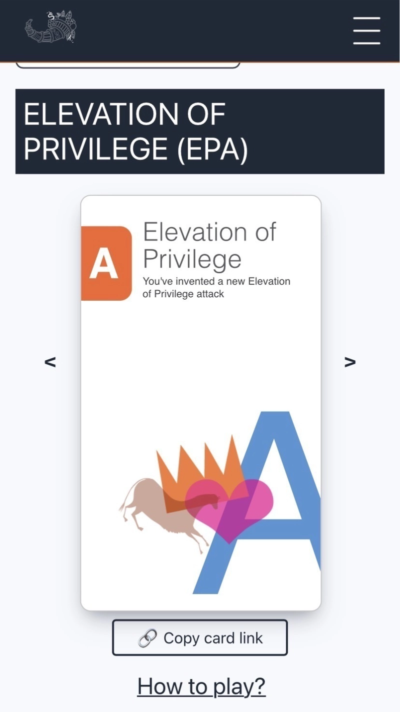
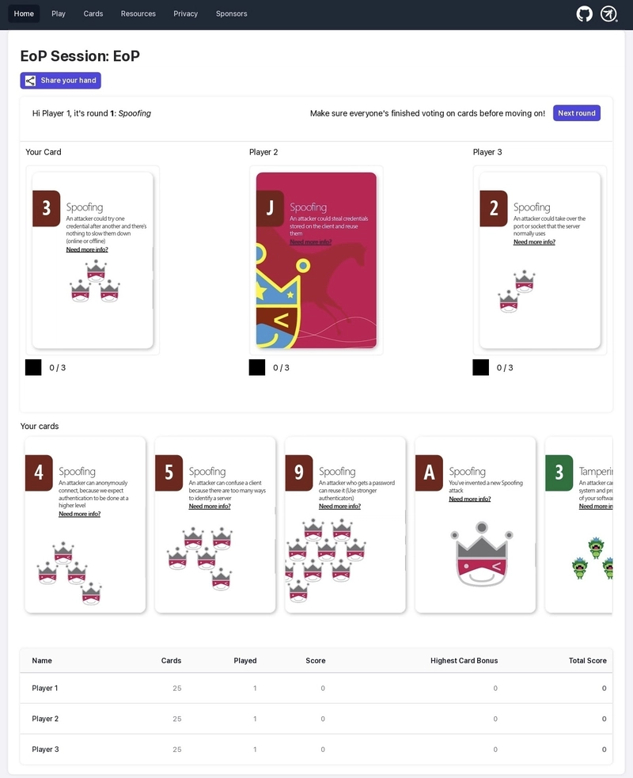
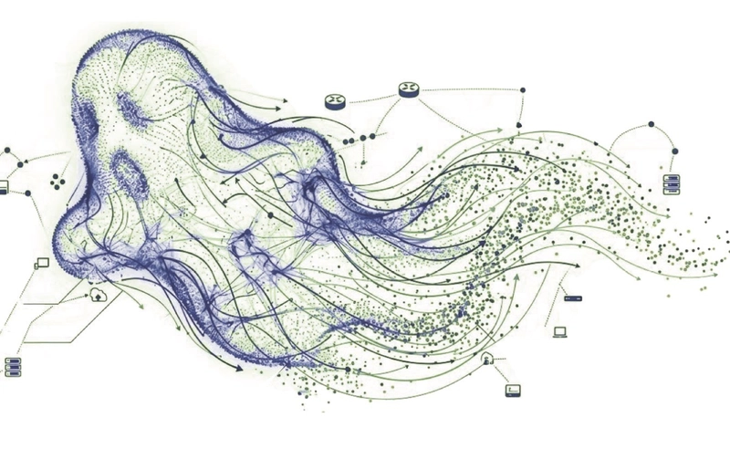
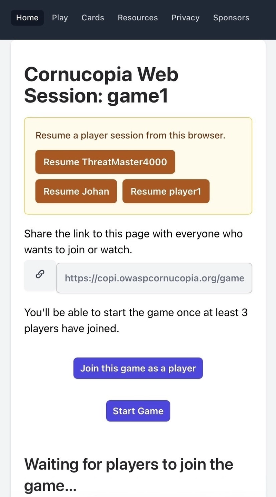
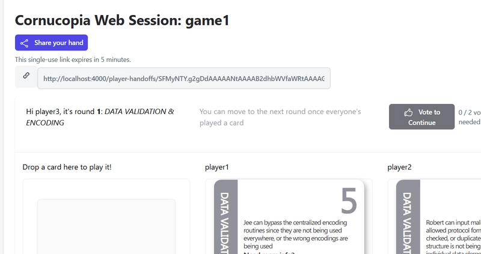
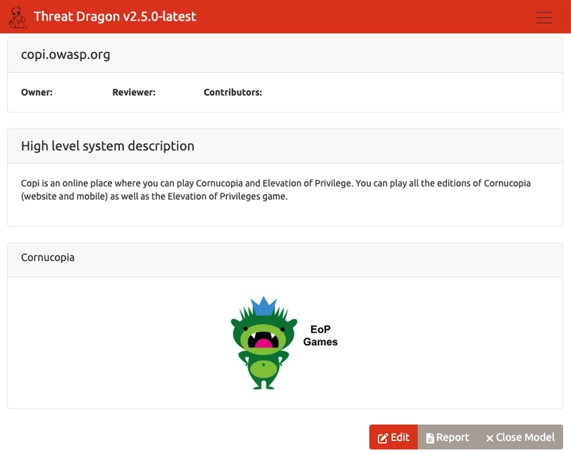
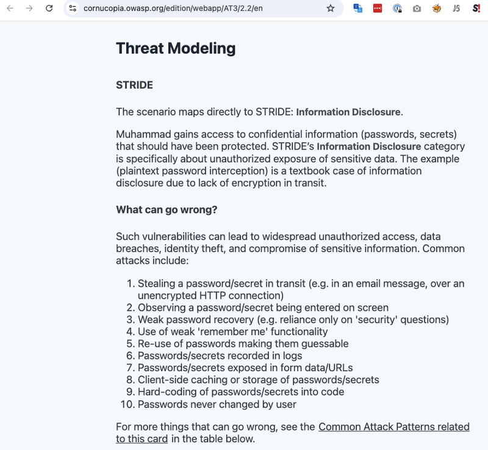

# OWASP Cornucopia v3 with EoP and PHANTOM-B

__We’re thrilled to bring you [OWASP Cornucopia v3.4](https://github.com/OWASP/cornucopia/releases/tag/v3.4.0) with an update that expands how we identify threats, whether you're mapping out traditional applications or diving headfirst into the latest AI architectures.__

---

## Elevation of Privilege (EoP)

One of the exciting updates in this release is the addition of the [Elevation of Privilege (EoP) deck](https://cornucopia.owasp.org/edition/eop) to the Cornucopia Help Pages. The new help pages are directly linked from our online game engine Copi when you play EoP at copi.owasp.org

### We Need Your Help!

While the game is live, we are actively looking for community contributors to help us with the help pages for each of the EoP cards. Specifically, we need security minds to help players better answer:

*   **What can go wrong?**
*   **What are we going to do about it?**

If you have experience with EoP or want to flex your threat mitigation muscles, we would love your pull requests to help guide players!

Why are we doing this? Well, first off, it is to give players the option to visit the EoP help pages while they are playing EoP at [copi.owasp.org](https://copi.owasp.org)!

When playing EoP at [copi.owasp.org](https://copi.owasp.org), you will now be able to click the «Need more info» links on each card, which will take you to the help pages, and we are looking for your expertise to fill them out.

### Thanking Our GSoC Contributors

I want to take a moment to extend a massive thank you to our Google Summer of Code (GSoC) student, Ayman Algamal. Ayman has taken on adding the EoP game to our card browser for OWASP Cornucopia. At a high level, this project aims to solve the current roadblock where OWASP Threat Dragon lacks the ability to integrate EoP into their EoP games threat modelling diagrams. By adding a fully browsable EoP deck and exposing the cards through the existing API, Ayman's work will cleanly unblock this integration. We hope this will help development teams to more easily use EoP during their threat modelling sessions. Read more about how further down!

## AI Threat Modelling with PHANTOM-B

As we look at the shifting landscape of application security, Large Language Models (LLMs) and Agentic AI are introducing entirely new threat vectors. To help you tackle these, the Cornucopia Companion suits for [**Large Language Models**](https://cornucopia.owasp.org/edition/companion/LLM2/1.0/en#card) and [**Agentic AI**](https://cornucopia.owasp.org/edition/companion/AAI2/1.0/en) have been upgraded. 

We have officially added **PHANTOM-B** mapping to [each of these cards](https://cornucopia.owasp.org/edition/companion/AAIK/1.0/en#PHANTOM-B). If you check the help pages for the LLM and Agentic AI cards, you will now find detailed explanations for these mappings to help your team get familiar with AI Threat Modelling natively in your sessions.

### What is PHANTOM-B?

If you haven't read Adam Shostack's recent post on [Why PHANTOM-B?](https://shostack.org/blog/why-phantom-b/), PHANTOM-B is a tool designed to structure how you answer the question: *"What can go wrong?"* (with the LLM parts of the system).

Created by Adam Shostack and the Shostack + Associates team—and validated alongside hyperscalers and global financial institutions—it serves as a STRIDE-analogous mnemonic specifically engineered for LLMs. While vulnerability lists like the OWASP LLM Top 10 are fantastic for general awareness, they don't explicitly tell you how *your specific architecture* will fail. 

PHANTOM-B provides a repeatable, lightweight threat elicitation tool that focuses strictly on what engineering teams can actually control and influence, scaling down complex generative AI behaviours into an actionable map.

Seats are filling up fast for Shostack + Associates Threat Modelling Intensive with Complete AI at this year’s Black Hat conference. If you are interested in knowing more about AI Threat Modelling and are in the vicinity, you should not forget to sign up.

Registrations for their course are apparently still open! [Black Hat training schedule](https://blackhat.com/us-26/training/schedule/index.html#adam-shostacks-threat-modeling-intensive-with-complete-ai-51473).

## Cornucopia, now 100% synced with AISVS v1.0

In case you missed it, AISVS - OWASP Artificial Intelligence Security Verification Standard was recently released as version 1.0, and we have made sure OWASP Cornucopia is correctly mapped to AISVS. This means that after you have figured out what can go wrong with LLMs and Agentic AI during the threat modeling sessions, we can help you answer the question: *«What are we going to do about it?»*

A special thanks to Mayur Agnihotri for adding AISVS v1 [“High-Impact Action Approval and Irreversibility Controls”](https://github.com/OWASP/AISVS/blob/main/1.0/en/0x10-C09-Orchestration-and-Agentic-Action.md#c92-high-impact-action-approval-and-irreversibility-controls) to the [Agentic AI cards](https://cornucopia.owasp.org/edition/companion/AAIK/1.0/en#What-are-we-going-to-do-about-it?) and to Adarsh Kumar for continuing to push out bug fixes. You both rock!

## Smarter, Smoother Game Sessions

Finally, we know that scheduling a full threat modelling session with your entire team isn't always easy, and sometimes network connections and web browsers fail. 

To improve the player experience, we have upgraded game sessions by saving the session state **server-side**. In addition to stability, we have introduced the concept of **sharing your card hand**. If you run out of time or have an emergency, you can simply hand off your cards so another team member can seamlessly take over your spot.

We can’t wait for you to try out 3.4.0. Grab your team, deal your hands, and let’s make threat modelling fun again!

## Threat Dragon and EoP Games

When choosing a tool for publishing our threat model, we chose [OWASP Threat Dragon](https://www.threatdragon.com/#/). OWASP Threat Dragon is a free, open-source, cross-platform threat modelling application. It is used to create threat modelling diagrams and list threats for elements within the diagrams. Mike Goodwin created Threat Dragon as an open-source community project that provides an intuitive, accessible way to model threats.

OWASP Threat Dragon recently released this possibility in v2.6. This was just the start of integration between the two projects. In v2.7 of OWASP Threat Dragon, we will make both the OWASP Cornucopia Companion Edition and Elevation of Privilege available from Threat Dragon!

It's now possible to create your OWASP Cornucopia Threat Model directly in OWASP Threat Dragon. When creating a new diagram for your threat model, simply choose to create an EoP Games diagram. We chose to call the diagram EoP Games for two reasons. One, OWASP Cornucopia is derived from the [Elevation of Privilege game](https://shostack.org/games/elevation-of-privilege) created by Adam Shostack. Second, we don't want to stop with OWASP Cornucopia. We also want to add other EoP games, such as the original Elevation of Privilege game.

Once you have created an EoP Games diagram, you can add OWASP Cornucopia threats to your threat model. The specific threat you add will get a link reference to the [OWASP Cornucopia website](https://cornucopia.owasp.org/edition/webapp/AT3/2.2/en#Threat-Modeling), where you will find guidance on threat modelling and STRIDE, which will help you in identifying what can go wrong and what to do about it. You can also find a [complete mapping](https://cornucopia.owasp.org/edition/webapp/AT3/2.2/en#What-are-we-going-to-do-about-it?) to [OWASP ASVS](https://cornucopia.owasp.org/taxonomy/asvs-4.0.3/02-authentication/05-credential-recovery#V2.5.2), [OWASP Developer Guide](https://devguide.owasp.org/en/04-design/02-web-app-checklist/06-digital-identity/#1-authentication-a), and all [relevant CAPECs](https://cornucopia.owasp.org/taxonomy/capec-3.9).

## Final words

OWASP Cornucopia welcomes any input or improvements you might be willing to share with us. For anyone wanting to share their opinion, please don't hesitate to [visit our repository](https://github.com/OWASP/cornucopia/issues), share your feedback, and, if appropriate, give us a star⭐️.

<noscript>
    
You cannot view this video directly because JavaScript is disabled. Click <a href="https://www.youtube.com/watch?v=XXTPXozIHow" title="How to play OWASP Cornucopia" target="_blank" rel="noopener">here</a> to watch the video on YouTube.

</noscript>
<iframe credentialless anonymous class="how-to-play" frameborder="0" title="Youtube: How to play OWASP Cornucopia"
src="https://www.youtube.com/embed/XXTPXozIHow?si=uIi_VXDtSBkS027S" referrerpolicy="strict-origin-when-cross-origin" allowfullscreen >

You cannot view this video directly because iframes are disabled. Click <a href="https://www.youtube.com/watch?v=XXTPXozIHow" title="How to play OWASP Cornucopia" target="_blank" rel="noopener">here</a> to watch the video on YouTube.
</iframe>

---

[OWASP Foundation](https://owasp.org "[external]") is a non-profit foundation that envisions a world with no more insecure software. Our mission is to be the global open community that powers secure software through education, tools, and collaboration. We maintain hundreds of open source projects, run industry-leading educational and training conferences, and meet through over 250 chapters worldwide.