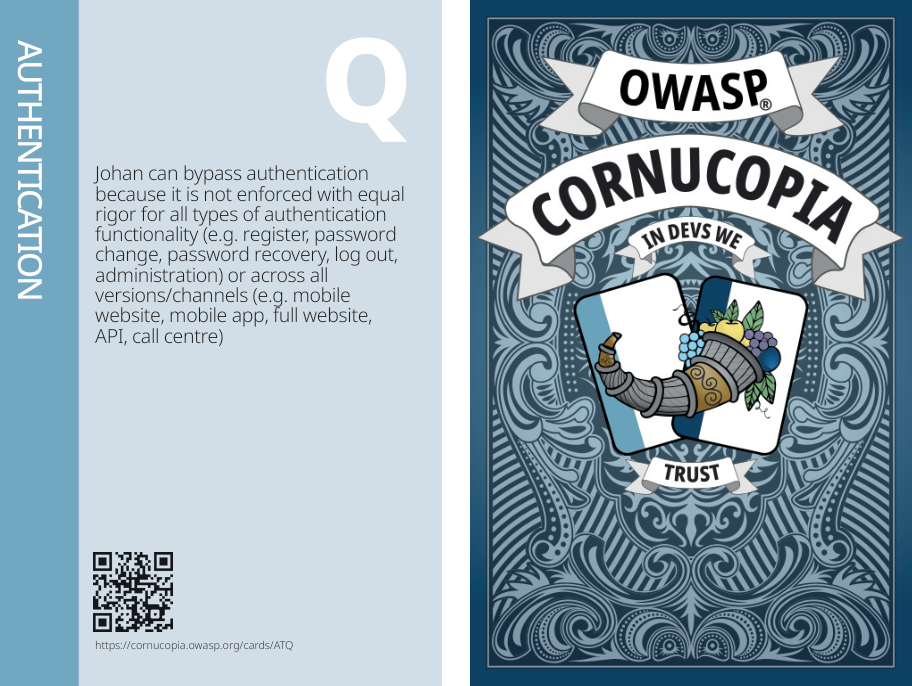
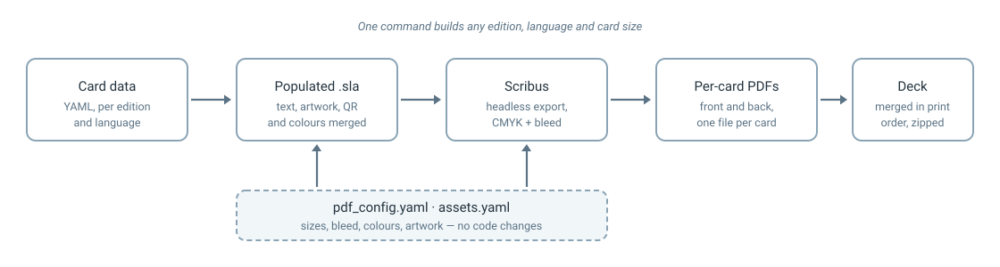
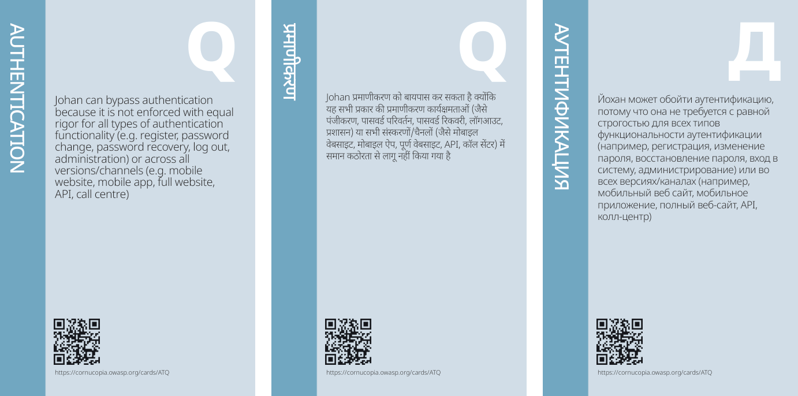

# Automating print-ready card decks with Scribus

## GSoC 2026 Final Work Product

- **Contributor**: Mradul Tiwari
- **GitHub**: [@Mysterio-17](https://github.com/Mysterio-17)
- **LinkedIn**: [Mradul Tiwari](https://www.linkedin.com/in/mradul-tiwari-021774214)
- **Organization**: [OWASP Cornucopia](https://cornucopia.owasp.org)
- **Mentors**: [@cw-owasp](https://github.com/cw-owasp), [@sydseter](https://github.com/sydseter), [@rewtd](https://github.com/rewtd)
- **Project**: [Automated print-ready proofs via Scribus](https://github.com/OWASP/cornucopia/issues/583)

*This work was done as part of Google Summer of Code 2026 with OWASP on the Cornucopia project.*

## One licence stood between us and a printed deck

Cornucopia is a card game, and a card game eventually has to become cards. Everything else about the project is open: the card text lives in YAML, the translations are contributed by the community, the website builds itself, and every release is automated.

Everything except the last step. Turning cards into something a printer would accept meant opening the decks in Adobe InDesign, adjusting fonts and templates by hand, and exporting. That put a commercial licence and one person's availability between a merged pull request and a deck anybody could print. It could not run in CI, and it could not run for a contributor who simply wanted to see their translation on a card.

This project removes that step.

## What exists now

The decks are now built by a Python tool that drives [Scribus](https://www.scribus.net/), an open-source page layout program, in headless mode. It takes the same YAML the rest of the project already uses, merges it into a Scribus template, and exports print-ready PDFs — CMYK, with bleed and optional printer's marks.

Nothing above was drawn by hand. The suit band, the card letter, the description, the QR code and the card back are all placed by the tool from the card data, and the whole deck comes out in the order a printer expects, with each card's back page ahead of its front for duplex printing.

A full run currently produces **32 decks and 2,556 cards**:

| Edition | Cards | Languages | Decks |
|---|---|---|---|
| Website App | 80 | 11 | 22 |
| Mobile App | 80 | 4 | 8 |
| Companion | 78 | 1 | 2 |

Two card sizes — bridge and tarot — are built for every one of those.

## How it works

Scribus files are XML, which turned out to be the useful part. Rather than trying to draw a card programmatically, the tool takes a designer-made template and fills it in: text frames get their strings, image frames get their artwork, and colour swatches are injected into the document at build time so the template does not need to know in advance what colour any suit is. Scribus is then asked to export the result.

That split matters. A designer can still open the template in Scribus and move things around, and the tool will keep working, because it looks up frames by name rather than by position.

## What went beyond the proposal

The proposal described a converter that produced full decks. Most of what got built on top of that came out of review, and it is the part I would point at first.

**Nothing is hardcoded.** Editions, languages and card sizes are discovered from the files that are present. Dropping a new translation into `source/` is enough for it to be built; adding a new edition needs artwork and a few lines of YAML, and no change to any script. This was the single most valuable piece of direction I received, and it changed the shape of the whole tool.

**You can build one card.** The generator takes `--edition`, `--language`, `--size` and `--cards`, in any combination. Checking one card in one language takes seconds instead of rebuilding 2,556 of them. For a translator who wants to see their work on a real card, this is the difference between the tool being usable and not.

**The layout lives in configuration.** Card dimensions, bleed, fonts, font sizes, colours, artwork paths, filenames and sort order are all in `pdf_config.yaml` and `assets.yaml`. Bleed is configurable from 0 to 6mm and printer's marks can be turned on or off, so a deck can be produced to whatever a particular print vendor asks for without touching Python.

**Packaging is optional.** Zipping decks and deleting the intermediate files are both flags rather than assumptions, so the tool fits into a release pipeline or a laptop equally well.

There is also a small diagnostic script, `check_environment.py`. Scribus runs scripts in its own embedded Python, which is usually not the `python3` on your PATH, and the resulting "module not found" errors are genuinely confusing. Running the script both ways prints which interpreter is which and what each one can see. It is the least interesting file in the project and probably the one that will save the most time.

## Eleven languages, one template

The same template produces all of these. Fonts and text sizes are per-language settings, because Devanagari and Cyrillic do not occupy the same space as Latin text at the same size.

The Russian card is worth a second look: its court letter is **Д**, not Q. Court cards are labelled from the card data rather than from the card's ID, so languages that letter their courts differently come out right. That was a bug before it was a feature.

## Making it trustworthy

The tool rewrites 2,556 files. Reviewing that output by eye is not possible, so the approach was to make change safe rather than to inspect it.

Every generated `.sla` file from a known-good run was kept, and after each refactor the whole set was regenerated and compared byte for byte against it. If a change was meant to be behaviour-preserving, the comparison had to come back with 2,556 identical files and zero differences. It did, every time — including through a refactor that reorganised most of the generator to satisfy the repository's lint rules.

That check caught real mistakes, one of them mine: while extracting a helper function I dropped an argument that only affected court cards in Russian and Ukrainian. Two languages, three cards per suit. No human review would have found it. The byte comparison found it immediately.

Alongside that there are **100 unit and integration tests**. The integration tests populate the real Scribus template and assert on the XML that comes out, so they test the thing that actually ships rather than a mock of it.

## Bugs worth mentioning

A few problems were only visible once real decks were generated:

- **Court artwork resolved to the wrong file.** The configuration and the artwork disagreed about how court card names were spelled. It is now resolved by convention with a clear order of precedence, so a suit can override one card without restating everything.
- **Tarot cards silently lost their colours.** Every colour operation shared one `try` block, so the first failure skipped the rest without complaint. Each is now attempted independently and failures are reported.
- **QR code generation broke on a dependency upgrade.** A newer release stopped falling back to a pure-Python image backend. The fix was to check that the fallback actually works rather than that the import succeeds — importing it succeeds either way and fails later.

## What comes next

**Custom decks.** The pipeline already replaces artwork per card and per suit from configuration, which is most of what a build-to-order deck needs. Letting a local chapter supply their own card back and generate a co-branded deck they can take to a printer is tracked as [issue #1104](https://github.com/OWASP/cornucopia/issues/1104), and it was waiting on this one — so it is now unblocked.

**PDF/X-1a.** The decks are CMYK with proper bleed today, which is what most printers ask for. The next step up is a formally tagged PDF/X-1a file, and the configuration hook for the ICC profile it needs is already in place and wired through — what remains is agreeing which CMYK profile to standardise on, which is a decision to make with a printer rather than in code.

**A container for local use.** Scribus, its fonts and the Python packages in one image would remove the setup step entirely for anyone who wants to build a deck once.

## What I learned

Most of what I learned was about verifying work rather than producing it. I started this project able to write a script that generated the right output; I finished it in the habit of proving that a change had not altered anything it should not have. The byte-comparison approach cost an afternoon to set up and repaid it many times over.

The other lesson was about designing for people who are not me. Almost every improvement described above — dynamic discovery, configuration over code, building a single card — came from being asked why something was assumed rather than configured. The tool is considerably better for it, and it is a question I now ask myself before someone else has to.

## Thanks

To **Colin Watson**, whose review shaped this tool more than any other single influence. The requirement that nothing be hardcoded, that editions and languages be discovered rather than listed, that layout decisions belong in configuration rather than in Python, and that packaging be a choice rather than an assumption — all of that came from him, and each one made the tool meaningfully better than what I had proposed. He also worked out the CMYK values for the suit colours and the court cards, which is not the kind of help you can look up. Being asked "why is this hardcoded?" enough times changes how you write software.

To **Johan Sydseter** and **Grant Ongers**, for steady direction throughout, for pushing on testing and quality when it would have been easy to call the feature finished, and for reviews that were quick enough to keep the work moving.

And to OWASP and Google Summer of Code for the opportunity. Cornucopia is a project where a contribution ends up in people's hands as physical cards, which is a rare and good thing to be able to say about a summer of writing code.
