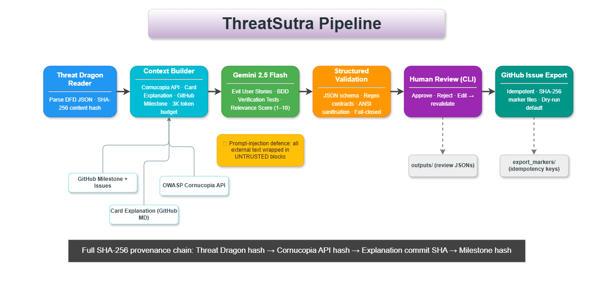
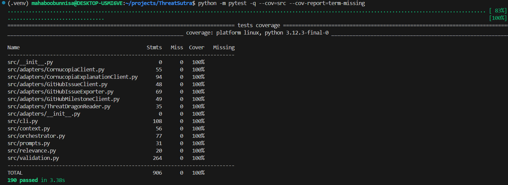

## GSoC 2026 Final Work Product

- **Contributor**: Mahaboobunnisa Md
- **GitHub**: [@Mahaboobunnisa123](https://github.com/Mahaboobunnisa123)
- **LinkedIn**: [Mahaboobunnisa (Shabnam) Md](https://www.linkedin.com/in/mahaboobunnisa123)
- **Organization**: [OWASP Cornucopia](https://cornucopia.owasp.org)
- **Mentors**: ([@sydseter](https://github.com/sydseter)), [@rewtd](https://github.com/rewtd), [@cw-owasp](https://github.com/cw-owasp)
- **Project**: [ThreatSutra](https://github.com/owaspcornucopia/ThreatSutra)

# ThreatSutra: Automating Security Requirements with AI

*This work was done as part of Google Summer of Code 2026 with OWASP on the Cornucopia project.*

ThreatSutra is an automated AI agent that enriches OWASP Threat Dragon models with Cornucopia data to generate testable security requirements via AI. It produces validated evil user stories and BDD verification tests, exporting them idempotently to GitHub Issues with a full SHA-256 provenance chain.

## Problem & Motivation
We already have great tools for identifying security risks. OWASP Threat Dragon lets teams diagram exactly what could go wrong in a system, and OWASP Cornucopia gives us a fantastic, shared vocabulary for categorizing those abuses. But after a good threat-modeling session, teams usually just walk away with a diagram and a list of threats. That’s where the workflow usually stalls. There is a massive gap between saying "we identified this threat" and actually handing a developer a verifiable ticket they can pick up, test, and close.

Right now, that translation step is entirely manual. Someone has to sit down, read the threat, figure out what test would prove it's handled, and write it up with acceptance criteria from an attacker's perspective. Because this takes so much time and specific security knowledge, it’s inconsistent across teams. Worse, it’s almost always the first thing that gets skipped under deadline pressure. When that translation gets skipped, the risks we worked so hard to identify never actually make it into a sprint as real, testable work. 

**ThreatSutra solves this**: Given a Threat Dragon JSON export and a GitHub milestone, it automatically generates structured, validated, human-approved security requirements ready to land in any backlog.

*ThreatSutra architecture: adapters → orchestrator → AI → exporter*

## My Progress
Over the course of 45 commits, each item below represents a closed issue and a discrete, testable unit of work.
- **ThreatDragonReader** - loads and validates the DFD JSON model, extracts each threat with its diagram/cell coordinates, and computes a SHA-256 content hash used throughout the pipeline for provenance.
  [`Add adapters`](<https://github.com/owaspcornucopia/ThreatSutra/commit/c8a935753aa8be9b93c06c4881a9b6c2ee5d4c97>)

- **CornucopiaClient + CornucopiaExplanationClient** - REST client that fetches card metadata from the OWASP Cornucopia API, plus a GitHub-backed markdown parser that pulls the card's scenario, requirements, and mitigations at a pinned commit SHA so outputs are reproducible.
  [`Add adapters`](<https://github.com/owaspcornucopia/ThreatSutra/commit/c8a935753aa8be9b93c06c4881a9b6c2ee5d4c97>)

- **Context construction + token budget** - assembles `AnalysisContext` with a `SourceProvenance` tuple for every input source and enforces a 3,000-token ceiling; overflow raises `ValidationError` rather than silently truncating.
  [`Complete issue #10`](<https://github.com/owaspcornucopia/ThreatSutra/commit/f457be97fcf45261791eca64880111490ca60ad9>)

- **Evil user story generation** - Gemini generates attacker-framed stories in the exact `As a ..., I want to ..., so that ...` format. Every response is regex-validated; anything that doesn't match the contract is rejected outright.
  [`Update issues #5, #6, #7`](<https://github.com/owaspcornucopia/ThreatSutra/commit/8ef0e1f9bbe853efbbdfdf48122781cd6f74df0d>)

- **BDD verification test generation** - paired with each evil user story, a `Given ..., When ..., Then ...` test is generated, regex-validated, and stored alongside the story in the review record.
  [`Update issues #5, #6, #7`](<https://github.com/owaspcornucopia/ThreatSutra/commit/8ef0e1f9bbe853efbbdfdf48122781cd6f74df0d>)

- **AI relevance scoring** - a 1-10 relevance score is assessed per threat against the declared GitHub milestone's open issues, colour-coded green/yellow/red so reviewers can prioritise.
  [`Update issues #2, #9`](<https://github.com/owaspcornucopia/ThreatSutra/commit/91efee6cfeca1786aacae4a6d87dda08805f9abb>)

- **Prompt-injection defence** - all external source text (Threat Dragon content, Cornucopia markdown, issue bodies) is wrapped in `BEGIN UNTRUSTED` / `END UNTRUSTED` delimiters. The system instruction explicitly instructs Gemini to treat this text as data, never as instructions.
  [`Update issues #7, #8`](<https://github.com/owaspcornucopia/ThreatSutra/commit/afc58d262eaab78b0fd138e1e638d09bdc5bedfa>)

- **Human-in-the-loop review CLI** - an interactive terminal loop presents each artifact with its source threat, Cornucopia card, and relevance score. The reviewer approves, rejects, or edits; edits are revalidated against the same format contract before acceptance.
  [`Update issues #2, #9`](<https://github.com/owaspcornucopia/ThreatSutra/commit/91efee6cfeca1786aacae4a6d87dda08805f9abb>)

- **Idempotent GitHub Issue export** - approved artifacts are created as GitHub Issues with provenance metadata. A SHA-256 marker file per artifact prevents duplicates on re-runs. Without a write token the pipeline defaults to dry-run.
  [`Update issue #12`](<https://github.com/owaspcornucopia/ThreatSutra/commit/2ffb5519b8f9ae256e2c7326d49ba629230b0125>)

- **Fail-closed validation** - centralised `validation.py` enforces JSON schema, regex contracts, ANSI sanitisation, and token budgets across every pipeline boundary; no malformed output is ever silently accepted.
  [`Add validation imports & update orchestrator`](<https://github.com/owaspcornucopia/ThreatSutra/commit/9ae53466d0ed02628763c28789f5839b0d200f55>)
  

## Architecture & How It Works
The pipeline is linear and inspectable. Each stage has its own responsibility. No stage does another's job.

```
ThreatDragonReader  →  Context Builder  →  Gemini (prompts.py)
        ↓                    ↓                      ↓
  SHA-256 hash        SourceProvenance        UNTRUSTED blocks
                           ↓
                     validation.py  →  CLI reviewer  →  GitHubIssueExporter
                     (fail-closed)     (approve/edit)    (marker-file idempotency)
```
The adapters layer handles all external I/O — Threat Dragon file parsing, Cornucopia REST API calls, GitHub milestone and issue retrieval with automatic retry, in-memory caching, and content hashing. The context module assembles an `AnalysisContext` carrying provenance tuples and enforces a token budget. The orchestrator coordinates stages without containing any validation or export logic itself. Prompts are built with explicit `UNTRUSTED` block delimiters, and validation enforces JSON schema and regex contracts in a fail-closed model. The CLI presents artifacts for human review, and the exporter creates GitHub Issues idempotently via SHA-256 marker files.

## Tests & Quality
I set a personal target of 95 %+ coverage from the start; the suite finished at **100 %**.
| Metric | Result |
|--------|--------|
| Tests | **190 / 190 passing** |
| Coverage | **100 %** - 906 statements, 0 missed |
| CI | GitHub Actions, Python 3.10 / 3.11 / 3.12 ([workflow](https://github.com/owaspcornucopia/ThreatSutra/actions)) |
| Coverage gate | `--cov-fail-under=95` enforced on every push |

The test suite covers the full pipeline end-to-end: Threat Dragon model parsing and provenance hashing, all five adapter clients (retry logic, caching, schema validation, error paths), context assembly with token budget enforcement, prompt generation with UNTRUSTED block injection and token truncation, evil user story and verification test regex validation, relevance scoring with colour mapping, transient Gemini API error handling (503, 429, 500), the interactive reviewer loop (approve, reject, edit, dry-run), idempotency key generation and duplicate prevention in the exporter, and Cornucopia card markdown heading extraction.


*Test coverage report — 190 passed, 100 % across all modules*

## Future work - Milestone 2 (Phase 2) 
The next milestone extends ThreatSutra so every generated evil user story is also mapped to the matching AISVS requirements and AITG test guidance, with a reviewer decision (approve, reject, or not-applicable with a reason) on each individual item, a full coverage summary shown before anything exports, and a separate, explicit "confirm export" step. It's open now for any OWASP contributor to pick up.

## My Learning Experience
Before this project, I thought using AI just meant sending a prompt and getting a quick answer. I quickly learned that making an AI tool actually reliable is a lot harder. you have to strictly check everything it creates so it doesn't break the system. It was also a great challenge figuring out how to smoothly connect different tools, like pulling data from Threat Dragon and sending it directly to GitHub. Overall, building this from scratch for the open-source community has made me a much more careful and confident developer. 

## Acknowledgements
None of this happened in a vacuum. A huge thank you to my mentor, Johan Sydseter ([@sydseter](https://github.com/sydseter)), for the steady Monday and Thursday check-ins that kept this project honest and properly scoped right from week one. More importantly, thank you for all your quick responses and providing the kind of feedback that actually makes me to rethink entire design instead of just polishing the code. That kind of guidance made me a much better developer this summer.

Thanks to Colin Watson ([@cw-owasp](https://github.com/cw-owasp)) and Grant Ongers ([@rewtd](https://github.com/rewtd)) for taking the time to review my initial GSoC proposal. Your early feedback helped set a strong foundation for the project.

Thank you to the wider <strong><em> OWASP Cornucopia maintainers </em></strong> for being so welcoming, and for trusting a GSoC contributor with the chance to build a tool that real teams will actually use.

And finally, thank you to <strong><em> OWASP and Google Summer of Code </em></strong> for this incredible opportunity. Building an open-source project that bridges the gap between security and development has been a fantastic experience, and I am proud of what we shipped. 

<br>
<p align="center" style="color: #005B9F;">
  <strong><em>
  The OWASP Foundation is my first open-source organization, and OWASP Cornucopia is my first project. I look forward to contributing even more in the future!
  </em></strong>
</p>