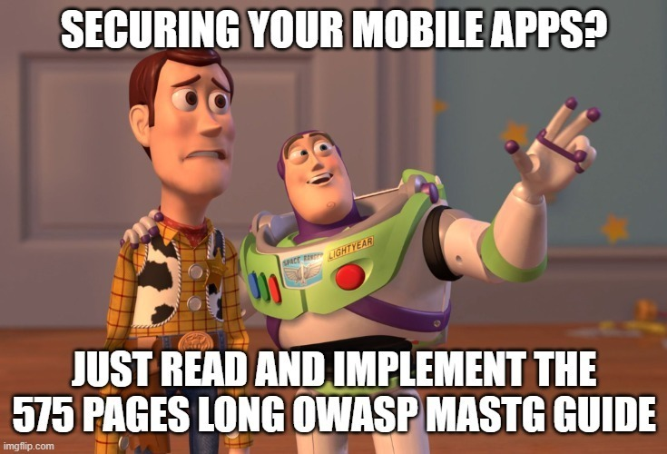
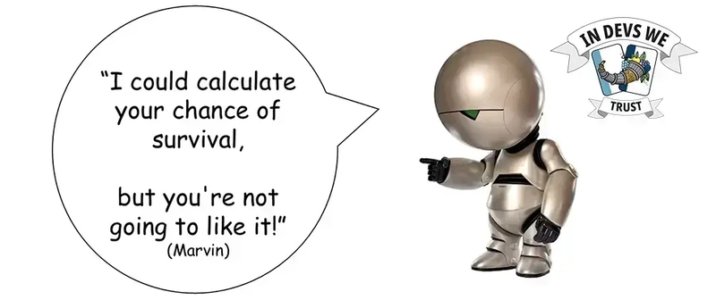
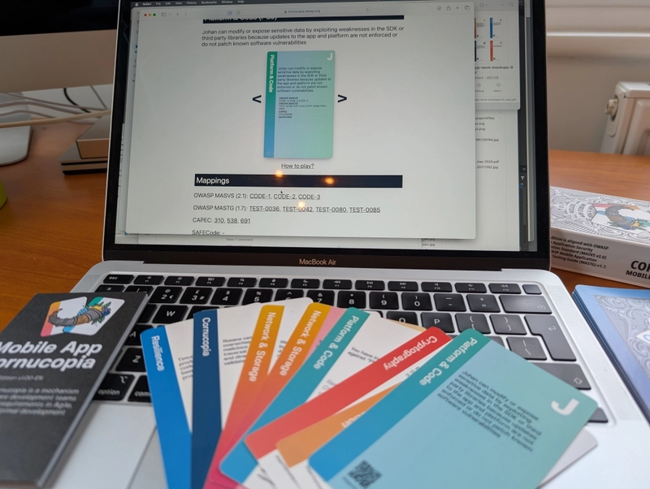
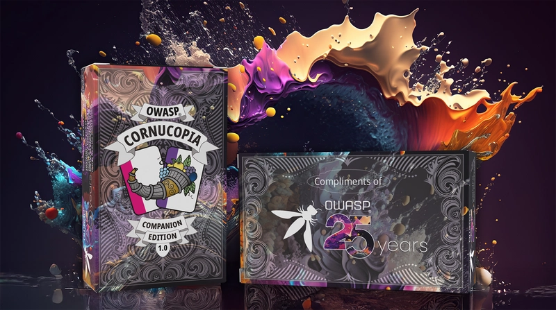
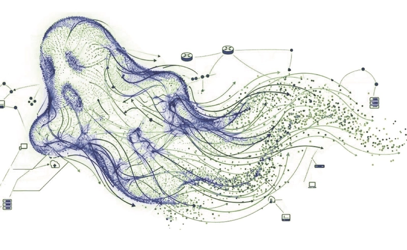
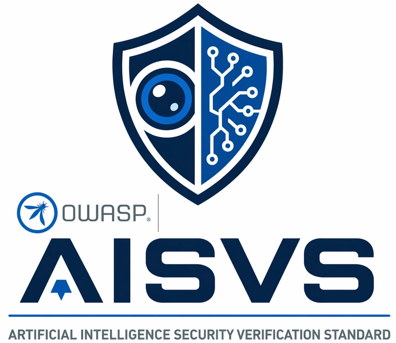
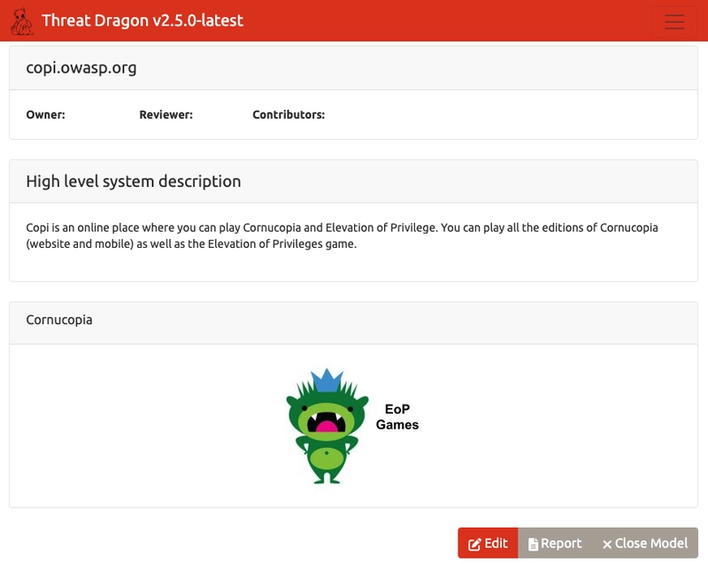
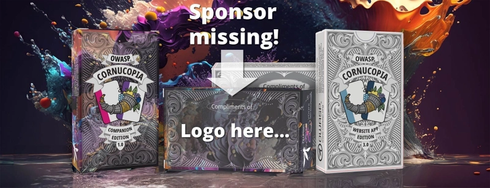

# OWASP Cornucopia Mobile App Edition v2.0

_We are happy to announce the release of the [OWASP Cornucopia Mobile App Edition v2.0](https://github.com/OWASP/cornucopia/releases/tag/v3.5.0). The latest edition is compatible with [MASVS v2.1](https://mas.owasp.org/MASVS/), [MASTG v2.0](https://mas.owasp.org/MASTG/), and [MASWE v1.0](https://mas.owasp.org/MASWE/), and features 80 threats that cover all the requirements, tests, and weaknesses of the OWASP Mobile Application Security Project._

---

## Why would you use OWASP Cornucopia Mobile App Edition?

At Admincontrol, the [OWASP Cornucopia Mobile App Edition is used to implement mobile application security by design](https://dev.to/owasp/how-to-pass-the-owasp-masvs-verification-by-design-2cf9). Before building mobile apps and features, OWASP Cornucopia helps the team identify threats during the threat modeling and design phase. For example, during gameplay, a developer identifies that [card AA3](https://owaspcornucopia.org/edition/mobileapp/AA3/2.0/en) should be considered during app development. Each  identified card includes a [mapping table](https://owaspcornucopia.org/edition/mobileapp/AA3/2.0/en#mapping) showing which CAPEC™s, OWASP [MASWEs](https://mas.owasp.org/MASWE/), [MASTG Best Practices](https://mas.owasp.org/MASTG/best-practices/#), [MASTG Knowledge base](https://mas.owasp.org/MASTG/knowledge/), [MASTG tests](https://mas.owasp.org/MASTG/), and [MASVS requirements](https://mas.owasp.org/MASVS/) apply when developing a specific mobile feature. This simplifies identifying mobile application security requirements during development and makes it possible to decide on security requirements during the development sprint in an agile, lean way. 

During gamification and threat modeling, the team identifies threats that naturally drive application security requirements. Doing this before sprint planning makes threat modeling and security requirement analysis part of the team's SDLC. In addition, it’s the team that gets to decide «what can go wrong» and «what we are going to do about it». Letting the team decide ensures alignment with the application security requirements and security goals and prevents scope creep and dissatisfied scrum masters. Security awareness and a security sprint scope are created as a result. Doing games and threat modeling before sprint planning builds engagement, alignment, and security awareness without pushback that could push security issues to the backlog and let them be forgotten.

## Why should I do this when I can use AI agents?

There is this quote from David Dunning where he says: "If you're incompetent, you can't know you're incompetent. The skills you need to produce a right answer are exactly the skills you need to recognize what a right answer is."

> [«Fighting The Passive Learning Trap», Psychology Today](https://www.psychologytoday.com/us/blog/dear-life-please-improve/202506/fighing-the-passive-learning-trap)

What do I mean by that? Well, let's say your AI agents have created a beautiful threat model and secure design for your application that requires you to implement «[Just-In-Time Access](https://www.ibm.com/think/topics/just-in-time-access)», but then, during the development sprint, it clashes with one of the features that the product owner has been told to implement by the product manager. When asking your Claude-based AI agents to fix it, it takes an extraordinary amount of time and becomes really expensive. After it has finished, the AI agents' review comes back with 200 comments. The work never seems to finish, and the AI review agent, the AI threat modeling agent, and the AI Coding agent don’t seem to agree with each other. In the end, after a lengthy discussion with Claude, you understand that implementing Just-In-Time access is a much more extensive task than what you initially thought it was. After all, you didn’t have a clue about it in the first place. So what do you do? The product manager doesn’t give in; he wants his feature. Maybe Just-In-Time access isn’t that important after all? 
The feature ships, but the security remains underdeveloped. That is, until AI agents from North Korea come knocking.

There are no shortcuts to learning. You need to know what is important and how to make the right decisions. 
AI agents can’t make the decisions for you. AI agents are sycophants. They will happily cheer you on even if you make the wrong choices. This is why we do threat modeling. Through the threat modeling process, the whole team learns «what can go wrong» and «what we are going to do about it». Offshoring your decision-making processes is a terrible risk management strategy that will lead your life to ruin.

## Mobile App Edition v2.0

The latest edition is compatible with [MASVS v2.1](https://mas.owasp.org/MASVS/), [MASTG v2.0](https://mas.owasp.org/MASTG/), and [MASWE v1.0](https://mas.owasp.org/MASWE/), and features 80 threats that cover all the requirements, tests, and weaknesses of the OWASP Mobile Application Security Project.
The deck has six suits of 13 cards plus two jokers, with the suit names taken from MASVS: 
 - Platform & Code (PC)
 - Authentication & Authorization (AA)
 - Network & Storage (NS)
 - Resilience (RS)
 - Cryptography (CRM)
 - Cornucopia (CM), which contains threats related to MASVS Privacy requirements, and where we have also added some nasty cards related to mobile malware. 

The edition exists in English and has been translated into Hindi, Russian, and Ukrainian. 
To play the game online, visit [cornucopia.owasp.org](https://cornucopia.owasp.org) and click on «Play online».

## AI mobile development

With the new edition, you can also combine it with the OWASP Cornucopia Companion Edition. The new [OWASP Cornucopia Companion Edition](https://cornucopia.owasp.org/edition/companion) complements the existing two editions. The [OWASP Cornucopia Companion Edition v1.0](https://cornucopia.owasp.org/edition/companion) comes with 6 companion suits covering new topics:
 - Agentic AI (AAI)
 - Automated Threats (BOT)
 - Cloud (CLD)
 - Frontend (FRE)
 - Large Language Models (LLM)
 - DevOps (DVO)

A suit in the companion deck may replace (or be used in addition to) suits in the existing Mobile App Edition so that players can add a specific focus to their threat modeling. Let’s say you are building an LLM mobile application and want to perform threat modeling and security requirement analysis specifically for Mobile and LLM. You would then use the OWASP Cornucopia Mobile App Edition and the LLM companion suite as your elected OWASP Cornucopia focus area.

If you want to buy a physical version of the Companion Edition, go to [CyberSec Games](https://cybersecgames.com/pages/owasp-cornucopia-threat-modeling-collection) where you can buy the 25th Anniversary Edition as it also comes with both the Website App Edition 3.0 and the new OWASP Cornucopia Companion Edition. Watch for the Mobile App Edition v2.0, which may become available for pre-order soon.

## AI Threat Modeling with PHANTOM-B

As the application security landscape shifts, Large Language Models (LLMs) and Agentic AI introduce entirely new threat vectors. To help you tackle these, the Cornucopia Companion suits for [**Large Language Models**](https://cornucopia.owasp.org/edition/companion/LLM2/1.0/en#card) and [**Agentic AI**](https://cornucopia.owasp.org/edition/companion/AAI2/1.0/en) have been upgraded. 

We have added **PHANTOM-B** mapping to [each of these cards](https://cornucopia.owasp.org/edition/companion/AAIK/1.0/en#PHANTOM-B). If you check the help pages for the LLM and Agentic AI cards, you will now find detailed explanations for these mappings to help your team get familiar with AI Threat Modeling natively in your sessions.

### What is PHANTOM-B?

If you haven't read Adam Shostack's recent post on [Why PHANTOM-B?](https://shostack.org/blog/why-phantom-b/), PHANTOM-B is a tool designed to structure how you answer the question: *"What can go wrong?»* (with the LLM parts of the system).

Created by Adam Shostack and the Shostack + Associates team—and validated alongside hyperscalers and global financial institutions—it's a STRIDE-analogous mnemonic engineered specifically for LLMs. While vulnerability lists like the OWASP LLM Top 10 are fantastic for general awareness, they don't explicitly tell you how *your specific architecture* will fail. 

PHANTOM-B is a repeatable, lightweight threat elicitation tool that focuses strictly on what engineering teams can control and influence, scaling complex generative AI behaviors into an actionable map.

## Cornucopia, now 100% synced with AISVS v1.0

In case you missed it, AISVS - OWASP Artificial Intelligence Security Verification Standard was recently released as version 1.0, and we have made sure OWASP Cornucopia is correctly mapped to AISVS. This way, after you have figured out what can go wrong with LLMs and agentic systems during the threat modeling sessions, we can help you answer the question: *«What are we going to do about it?»*

## How to get those requirements into your issue tracking software

So you have done your threat modeling and security requirements analysis; what comes next? You need to create an issue the development team can work on, and add it to the development team's sprint. How do you do it? 
The OWASP Cornucopia project is creating a [requirements API](https://cornucopia.owasp.org/api/docs) that lets you harvest the security requirements you want. After you have [created your threat model in OWASP Threat Dragon](https://dev.to/owasp/the-cornucopia-of-gamified-threat-modeling-1c9k), extract its JSON response, look up the threats you have identified, and find the corresponding security requirements by using the API, merge the results together, and generate your [evil user stories](https://cornucopia.owasp.org/how-to-play#Gameplay---Modelling-evil-user-stories) by pushing the results to your issue tracking software just in time for the development team's next sprint.

## OWASP Cornucopia is looking for sponsors

Calling all AppSec heroes, card sharks, and generous sponsors! 🃏

By now, you probably think: «How can someone be crazy enough to do all this work for free?»
You are right; it’s absolutely crazy. Just think about it. All this card design and security requirement mapping work is done manually without the use of AI. We have fitted all OWASP ASVS, MASVS, AISVS, MASTG, DSOMM, SAMM, Web/Agentic/LLM Top 10, CAPECs, Mitre Atlas, etc., etc. ([look here for not even a full list](https://github.com/OWASP/cornucopia#the-cross-references-on-the-web-app-edition-deck-relate-to-the-following-versions-of-other-owasp-and-external-resources)) onto 240 playing cards divided on 3 decks that can be played both physically and digitally. It’s crazy, absolutely unique, lots of fun, and a practical solution that helps teams bake secure coding into everyday conversations. It turns threat modeling into something people actually want to do. Yes, really.
But here’s the twist…
The project is currently missing a sponsor.
That means there’s a golden opportunity for a forward-thinking company to:

-> Support an open, globally recognized OWASP project
-> Help make secure development more accessible (and enjoyable!)
-> Get your logo featured directly on the Cornucopia decks used by teams worldwide

Imagine your brand on desks during threat modeling sessions, workshops, and security training worldwide.
Not a bad place to be, right?

Whether you're a security vendor, consultancy, or just passionate about improving software security—this is a chance to give back to the community and gain visibility where it matters.
If that sounds interesting, now’s the perfect time to step in and deal yourself a winning hand.

1. Know a company that should jump on this? Tag them below
2. Curious about sponsoring? Let’s get the conversation going

Learn more at: https://cornucopia.owasp.org/news/20260525-become-a-cornucopia-sponsor

## Final words

OWASP Cornucopia welcomes any input or improvements you're willing to share. For anyone wanting to share their opinion, please don't hesitate to [visit our repository](https://github.com/OWASP/cornucopia/issues), share your feedback, and, if appropriate, give us a star⭐️.

<noscript>
    
You cannot view this video directly because JavaScript is disabled. Click <a href="https://www.youtube.com/watch?v=XXTPXozIHow" title="How to play OWASP Cornucopia" target="_blank" rel="noopener">here</a> to watch the video on YouTube.

</noscript>
<iframe credentialless anonymous class="how-to-play" frameborder="0" title="Youtube: How to play OWASP Cornucopia"
src="https://www.youtube.com/embed/XXTPXozIHow?si=uIi_VXDtSBkS027S" referrerpolicy="strict-origin-when-cross-origin" allowfullscreen >

You cannot view this video directly because iframes are disabled. Click <a href="https://www.youtube.com/watch?v=XXTPXozIHow" title="How to play OWASP Cornucopia" target="_blank" rel="noopener">here</a> to watch the video on YouTube.
</iframe>

---

[OWASP Foundation](https://owasp.org "[external]") is a non-profit foundation that envisions a world with no more insecure software. Our mission is to be the global open community that powers secure software through education, tools, and collaboration. We maintain hundreds of open source projects, run industry-leading educational and training conferences, and meet through over 250 chapters worldwide.