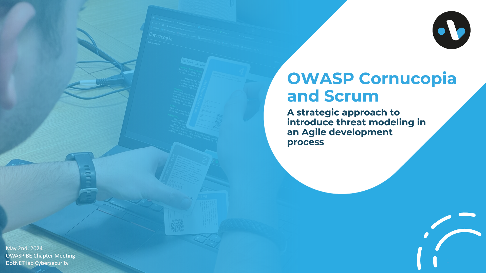

# Cornucopia talk OWASP chapter Belgium

On Thursday May 2nd we were invited to give a talk about Cornucopia at a meetup of the [OWASP Chapter Belgium](https://owasp.org/www-chapter-belgium/).

The agenda for the evening was as follows:
- 17h30-18h20: Welcome and refreshments
- 18h20-18h30: OWASP Update
- 18h30-19h30: Joris Gorinsek from NIKO: Navigating the Evolving Landscape of Cyber Security Legislation as an IoT Device Manufacturer
- 19:45-20h45: Ive Verstappen & Jef Meijvis from DotNET lab: OWASP Cornucopia and Scrum: A strategic approach to introduce threat modeling in an Agile development process
- 21:00: Close

[Ive](/author/ive-verstappen) and myself presented our experience and view on integrating Cornucopia in an agile scrum  development process. 

## Observations while playing Cornucopia
Over the last year we hosted quite a few Cornucopia sessions, during which we noted our observations.
A few key takeaway points:
### Timebox the session
Just as every scrum related meeting, it's really important to timebox the meeting.
This can be done by keeping the team that plays the game small enough.

### Cut discussions short
Don't let the Cornucopia session turn into a architectural or technical discussion.
Only discuss the cards and the threats, and move on to the next card once a threat is identified. 

### Limit the application scope
When the application being used to play the game becomes too big, it might be useful to limit yourself to a certain set of features instead of the entire application.

For those who would like to know more, the presentation can be downloaded at the bottom of the page. 

Some pictures:

![Ive presenting at the OWASP Belgium chapter meeting [medium]](owasp-ive.png)

![Jef presenting at the OWASP Belgium chapter meeting [medium]](owasp-jef.png)

![Playing a session of OWASP Cornucopia [medium]](playing-cornucopia.png)

After the presentations we had some time to network at the KDG institute in Antwerp. 
Thanks to the organization of the Belgian OWASP Chapter for the great event!

## Presentation
You can download the slidedeck we presented by clicking [here](/share/20240402-OWASP-CORNUCOPIA-KDG.pptx).

