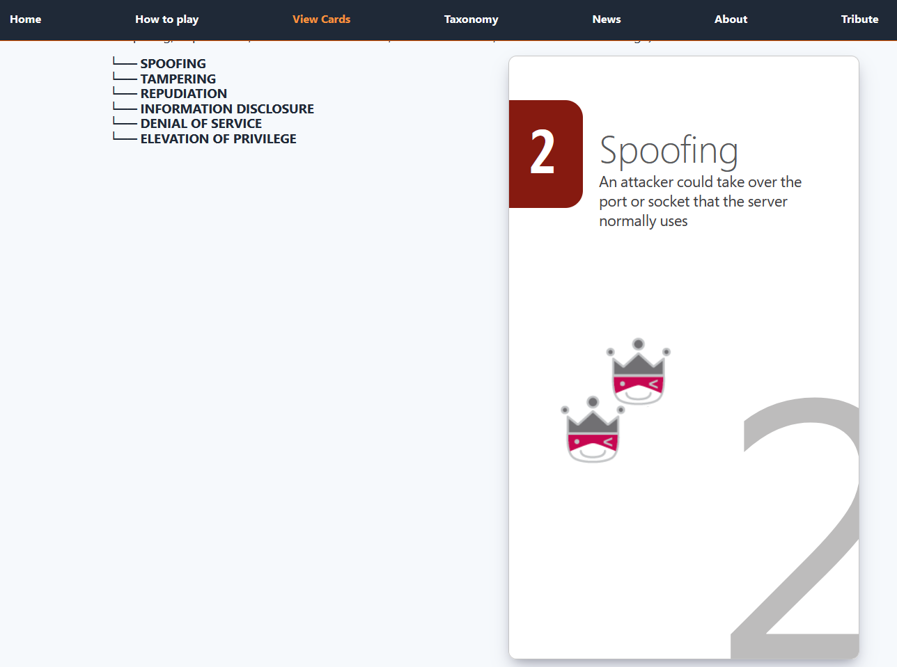
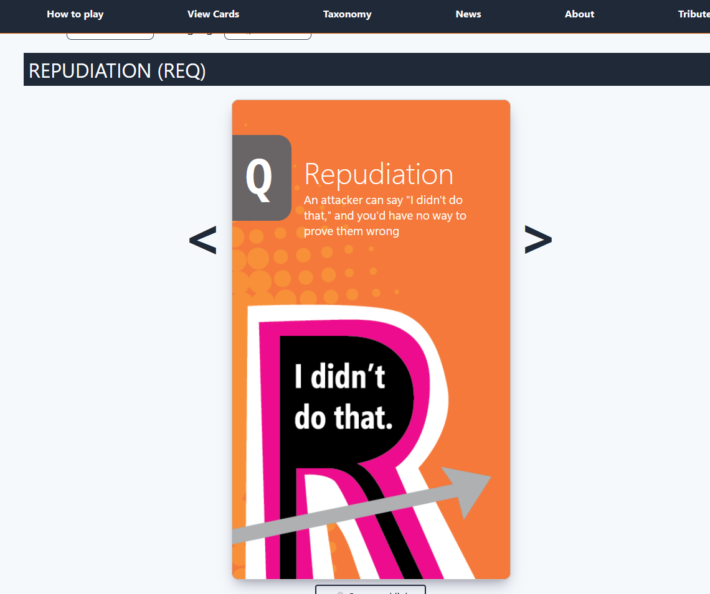
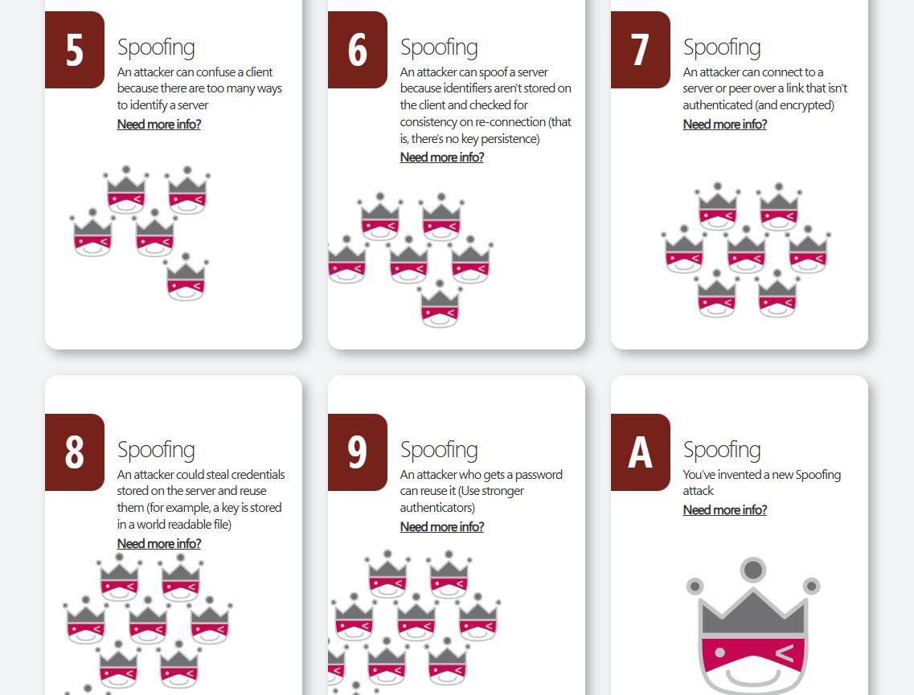
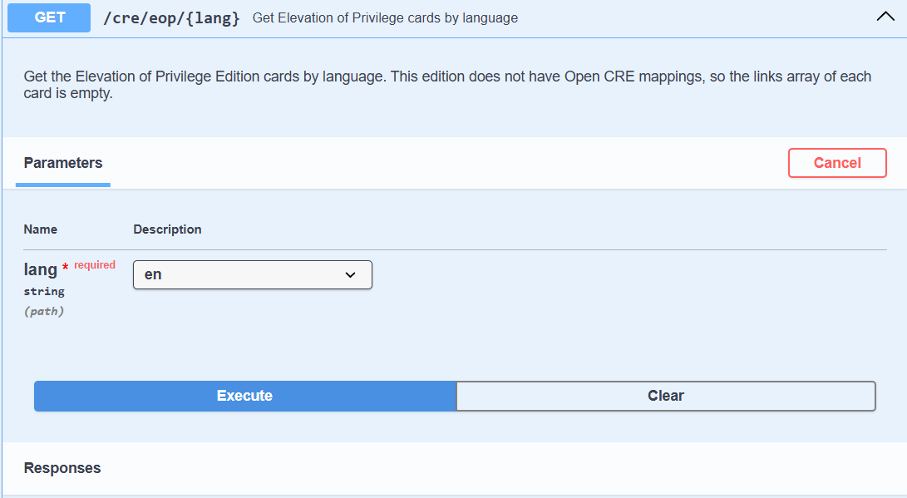
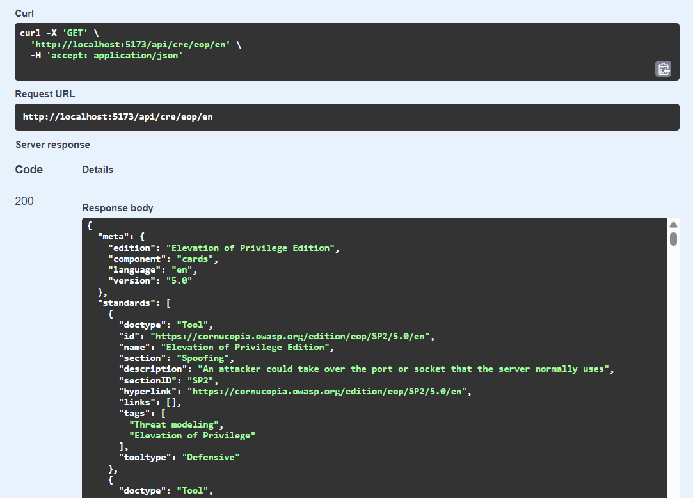

## GSoC 2026 Final Work Product

- **Contributor**: Ayman Algamal
- **GitHub**: [@ayman-art](https://github.com/ayman-art)
- **LinkedIn**: [Ayman Algamal](https://www.linkedin.com/in/ayman-algamal-9a6124229/)
- **Organization**: [OWASP Cornucopia](https://cornucopia.owasp.org)
- **Mentors**: [@rewtd](https://github.com/rewtd) (primary), [@sydseter](https://github.com/sydseter), [@cw-owasp](https://github.com/cw-owasp)

## Adding the EoP Game to the Card Browser

*This work was done as part of Google Summer of Code 2026 with OWASP on the Cornucopia project.*

OWASP Cornucopia converts essential, rigid security concepts into a gamified format where
developers can identify threats and security requirements in their applications without
needing prior knowledge of complex frameworks, all in an interesting way, by playing cards.

Before this project, [OWASP Threat Dragon](https://owasp.org/www-project-threat-dragon/) (OWASP's
open-source threat modeling tool for drawing system diagrams, recording security threats, and planning mitigations as part of a secure SDLC)
lacked the ability to integrate EoP threat modeling
because the EoP deck was not browsable or accessible through Cornucopia's API. This project, Adding the EoP Game to the Card
Browser, solves that by adding a fully browsable deck for Elevation of Privilege (EoP) to
OWASP Cornucopia and exposing EoP cards through the existing API. The work also adds a "Need
more info?" link on copi EoP cards, linking to their corresponding card pages on
cornucopia.owasp.org, to help players learn more about the cards.

## Project goals

From my accepted proposal, the deliverables were:

1. Data scaffolding and mappings: generating folders for all 78 EoP cards, each containing an
   explanation.md and a technical-note.md, and populating eop-mappings-5.0.yaml with metadata
   including stride, stride_print, and url for each card.
2. A browsable deck for EoP alongside the other decks, with an endpoint for each card.
3. Serving EoP cards in the Cornucopia API and updating the docs endpoints.
4. Adding a "Need more info?" link on copi.owasp.org EoP cards linking to their corresponding
   card pages on cornucopia.owasp.org.
5. Making the card browser maintainable for any new deck, by moving suit colors out of
   hardcoded CSS into a per-deck appearance YAML, storing per-card image paths in a card-images YAML, and having each deck's layout component
   use these YAML configs.

## Progress Report

#### [PR #3122](https://github.com/OWASP/cornucopia/pull/3122): Data scaffolding (M1)

Created card folders for all 78 EoP cards across its 6 STRIDE based suits (Spoofing,
Tampering, Repudiation, Information Disclosure, Denial of Service, Elevation of Privilege),
each with an explanation.md and a technical-note.md, and populated eop-mappings-5.0.yaml with
each card's metadata (id, value, url, stride, stride_print). Since this was going to be the
first of several editions onboarded this way, I suggested generating this scaffolding from a
script instead of doing it by hand, and my mentors agreed, so I wrote
`scripts/scaffold_cards.py` for it. My mentors flagged a path traversal risk in the script;
I fixed it with allowlist validation on every yaml-derived path component, plus 28 unit tests
covering the safety cases.

#### [PR #3181](https://github.com/OWASP/cornucopia/pull/3181): Deck browsing (M2)

Made the EoP deck actually browsable on the website. Registered the edition in the deck and
suit services and wired it into the existing card routes. The card styling was reworked to
faithfully reproduce the original printed EoP deck: element sizing, background watermark
numbers, suit tab colors, and per-card artwork, all derived from the official EoP card PDF,
rather than reusing the older `copi.owasp.org` styling. Also added a STRIDE mapping component
and a taxonomy/attacks section, and linked EoP cards inside the `copi.owasp.org` game engine
back to their new browser pages.

For M2, I rebuilt EoP's card styling directly from the original printed deck's PDF: element
sizing, watermark placement, suit tab colors, and per-card artwork, instead of reusing
`copi.owasp.org`'s existing styling. THis made the result much
closer to what the original card game actually looks like.

#### [PR #3254](https://github.com/OWASP/cornucopia/pull/3254): API endpoints (M3)

Exposed EoP through Cornucopia's public API (`/api/cre/eop/{lang}`, `/api/lang/eop/{version}`,
`/api/mapping/eop/{version}`) so external consumers like OWASP Threat Dragon can pull EoP card
data the same way they already do for the other editions. Added Spanish and Russian
translations alongside English, and documented the new endpoints in the OpenAPI spec.

#### [PR #3315](https://github.com/OWASP/cornucopia/pull/3315): Styling config (M4)

Moved EoP's card styling (suit colors, per-card image paths) out of inline code and into YAML
config, loaded through new `SuitStylingService` and `CardImagesService` classes with shared
caching logic. Built EoP-specific mapping and taxonomy components (`eopCardMapping.svelte`,
`eopCardTaxonomy.svelte`), registered per edition alongside the other decks', and an
auto-loaded `eopCard.css`. Fixed four card images that had opaque backgrounds hiding the watermark
artwork.

This milestone's mapping and taxonomy work also taught me something about abstraction. I
generalized the "registration" step early (a plain object map from edition to component, so
adding EoP meant one new line instead of another `{#if edition}` branch), but I did not
generalize the components themselves. Each edition still got its own hand-written taxonomy
component, so the underlying duplication just moved one level down. In hindsight, I would have
looked one step further before deciding an abstraction was done.

#### Currently in progress: mentor review follow-ups

Milestone 2's review ([full thread](https://github.com/OWASP/cornucopia/pull/3181)) surfaced a
longer list of refactoring follow-ups from [@sydseter](https://github.com/sydseter), covering
card ordering, suit ordering, deck and edition metadata, card IDs, and the game engine's deck
config. That work is currently underway in
[PR #3331](https://github.com/OWASP/cornucopia/pull/3331) (draft).

| PR | Milestone | Description | Status |
|---|---|---|---|
| [#3122](https://github.com/OWASP/cornucopia/pull/3122) | M1 | Data scaffolding and scaffold script | Merged |
| [#3181](https://github.com/OWASP/cornucopia/pull/3181) | M2 | Deck browsing and faithful card styling | Merged |
| [#3254](https://github.com/OWASP/cornucopia/pull/3254) | M3 | API endpoints (CRE/lang/mapping) | Merged |
| [#3315](https://github.com/OWASP/cornucopia/pull/3315) | M4 | Styling moved to config | Merged |
| [#3331](https://github.com/OWASP/cornucopia/pull/3331) | Follow-ups | Refactoring follow-ups from code review, beyond the original proposal scope | Draft |

## Demos / screenshots

### Browsing the EoP deck

The suit tree on the left lists all 6 STRIDE-based EoP suits; selecting one expands its cards
and shows a preview on the right.

Expanding a suit reveals its individual cards, like Information Disclosure here.

Each card also has its own detail view, with previous/next navigation through the suit.

The "Need more info?" link on each card is what connects `copi.owasp.org`'s EoP cards back to
their pages here on cornucopia.owasp.org.

### EoP in the API

The `GET /cre/eop/{lang}` endpoint serves EoP cards the same way the other editions are served.

Its response includes each card's standard, section, description, and tags.

## Scope of Future Development

Mentor review follow-ups are still open. That includes generating `cardIds.ts`, making the
taxonomy component and per-edition route branching config driven, generating the game engine's
card migration, and a card browser script that copies in everything needed from one folder
containing the yaml, images, css, and taxonomy for a new deck.

## What I Learned

- Automating the parts of the work that require repetitive effort, like generating folders for
  all 78 EoP cards instead of scaffolding each one by hand.
- It's always best practice to validate inputs and never trust user input.
- Tests are important: they describe how the code is supposed to behave, not just prove it
  works once.
- The importance of decoupling data from code: moving suit colors and card image mappings out
  of hardcoded CSS into YAML config is what made the card browser easy to extend to a new deck
  instead of requiring a code change per edition.
- How to suggest improvements to the plan and discuss them with mentors, like the scaffold
  script idea for M1 that they approved.
- How to communicate async and set up clear follow-ups in weekly standups with my mentor and
  reviewers.

## Gratitude

Thank you to Grant ([@rewtd](https://github.com/rewtd)), my mentor, for the regular calls and
meetings throughout the project where we worked through how to implement things and what to do
next. Thank you to Johan Sydseter ([@sydseter](https://github.com/sydseter)), who reviewed my
proposal and always reviewed my code throughout the project. Thank you to Colin Watson
([@cw-owasp](https://github.com/cw-owasp)), who opened the maintainability discussion that
reshaped much of the proposal into what M4 became. And thank you to the wider OWASP Cornucopia
community.

OWASP Cornucopia is my first open source project, and I plan to keep contributing after GSoC.